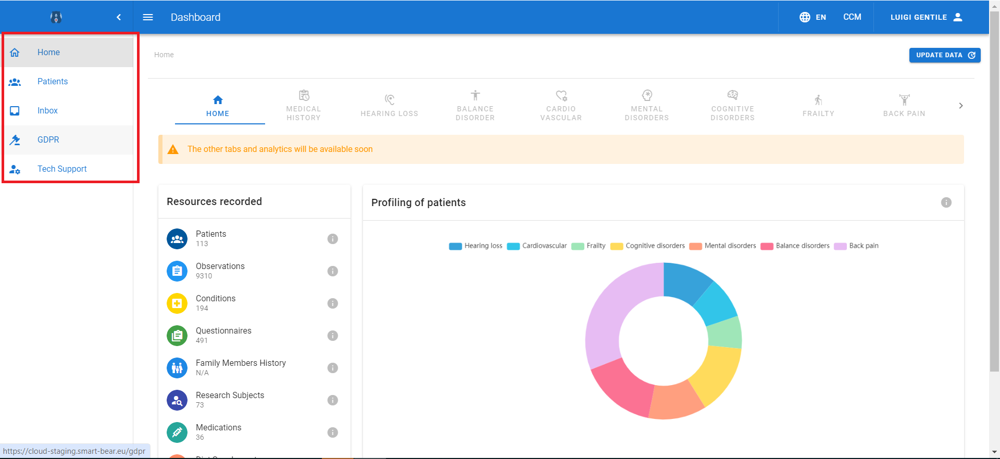

## Home Page

The Home page is shown in Figure 1 and is the first element showing up to the user. The Home page displays
an overview of the statistics related to the managed patients (see Figure 2)



A sidebar is visible on the left, It contains the following buttons:

- Home. It redirects to the Home page (see Sec. 3.2.1)
- Patients. It redirects to the Patients page (see Sec. 3.2.2)
- Notebooks. It redirects to the Notebook page (see Sec. 3.2.3)
- Inbox. It redirects to the Inbox page (see Sec. 3.2.4)
- GDPR. It redirects to the GDPR page (see Sec. 3.2.5)
- Tech Support. It redirects to the Tech Support Page (see Sec. 3.2.6).

A button is featured at the upper right corner to change the language: click on the button and select a language
from the dropdown menu (see Figure 3 and Figure 4).

## Patients Page

Click on the Patients button and the Patients page appears (see Figure 5 and Figure 6). The patients page
allows the user to:

1. Create a patient (see Section 4.3Errore. L'origine riferimento non è stata trovata.)
2. Edit and the eligibility screening of a patient (see Section 4.4)
3. Conduct the Baseline Assessment (see Section 4.5)
4. Manage a patient and his/her data in compliance with the GDPR (see Section 4.6)
5. Create and deliver Interventions (see Section 4.7).

Each patients has a tab including his/her data that is shown in Figure 7.

## Notebooks Page

Click on the Notebooks button. The Notebooks page appears (see Figure 8 and Figure 9). The Notebooks page
allows the user to create analytics by data from all the patients or a defined group of them and the data can be
updated at any time (see Figure 10). The creation of a notebook and Analytics is described in more detail in
Section 4.8.

## Inbox Page

Click on the INBOX button in the Home page (see Figure 11). The Inbox page appears that is divided into two
different tabs:

- The Notifications tab that is shown in Figure 12. Here all the notifications are visualized that are sent
to the assisted patients
- The Subscriptions tab that is shown in Figure 13. Here all the notifications are visualized that are sent
to the assisted patients if the user is an external CCM. More details on the Inbox page are available in
Section 4.9.

## GDPR Page

Click on the GDPR button and the GDPR Requests page appears (see Figure 14 and Figure 15). The GDPR
page allows the user to create requests on GDPR rights and visualize them (see Section 4.10).

## Tech Support

The Tech Support page provides functionalites to clinical and technical personnel for monitoring the ways the
device function. Click on the Tech Support button to open this page (see Figure 16), where it is possible to:
enter the overview interface for a patient, see the pairings when the last transmission took place, and possibly
also open the log files, including the list of transmissions to check if some of these are not valid and try to
understand where a problem has occurred (see Figure 17, Figure 18, Figure 19, Figure 20, Figure 21 Figure
22, Figure 23).