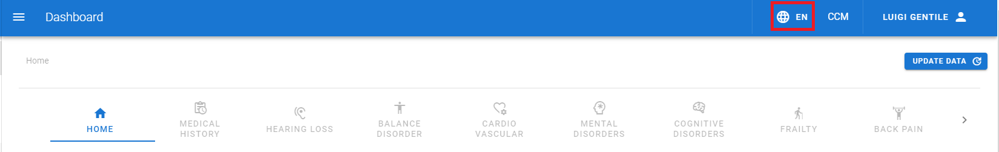
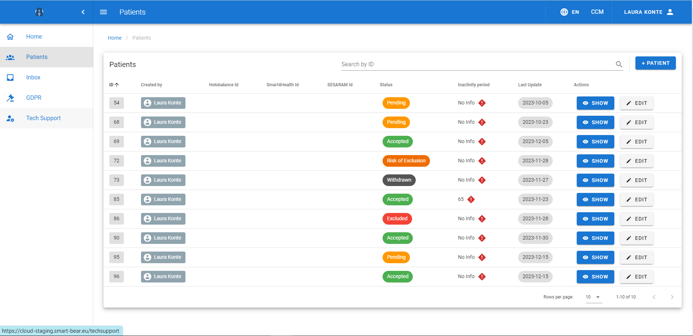

## Home Page {#home}

The Home page is shown in [Figure 1]( "Figure 1") and is the first element showing up to the user. The Home page displays
an overview of the statistics related to the managed patients see [Figure 2]( "Figure 2").

 <figure id="Pic_1" >

<figcaption style="text-align:center">Figure 1. </figcaption>
</figure>

 <figure id="Pic_2">

<figcaption style="text-align:center">Figure 2. </figcaption>
</figure>

 A sidebar is visible on the left, It contains the following buttons:

- Home. It redirects to the [Home]( "Home page") page.
- Patients. It redirects to the [Patients]( "Patients page") page.
- Notebooks. It redirects to the [Notebooks]( "Notebooks page") page.
- Inbox. It redirects to the [Inbox]( "Inbox page") page.
- GDPR. It redirects to the [GDPR]( "GDPR page") page.
- Tech Support. It redirects to the [Tech]( "Tech support page") page.

A button is featured at the upper right corner to change the language: click on the button and select a language
from the dropdown menu (see [Figure 3]( "Figure 3") and [Figure 4]( "Figure 4")).

 <figure id="Pic_3">

<figcaption style="text-align:center">Figure 3. </figcaption>
</figure>

 <figure id="Pic_4" class="centered-figure" style="align:center">

<figcaption style="text-align:center">Figure 4. </figcaption>
</figure>

## Patients Page {#patients}

Click on the Patients button and the Patients page appears (see [Figure 5]( "Figure 5") and [Figure 6]( "Figure 6")). The patients page allows the user to accomplish the following tasks:

1. Create a patient record (see [Patient registration]( "Patient registration"))
2. Edit and the eligibility screening of a patient (see [Exclusion criteria]( "Exclusion criteria"))
3. Conduct the Baseline Assessment (see [Baseline assessment]( "Patient registration"))
4. Manage a patient and his/her data in compliance with the GDPR (see [Patient management]( "Patient management"))
5. Create and deliver Interventions (see [Interventions]( "Interventions")).

Each patients has a tab including his/her data that is shown in [Figure 7]( "Figure 7"). 

 <figure id="Pic_5">

<figcaption style="text-align:center">Figure 5. </figcaption>
</figure>

 <figure id="Pic_6">

<figcaption style="text-align:center">Figure 6. </figcaption>
</figure>

 <figure id="Pic_7">

<figcaption style="text-align:center">Figure 7. </figcaption>
</figure>

## Notebooks Page {#notebooks}

Click on the Notebooks button. The Notebooks page appears (see [Figure 8]( "Figure 8") and [Figure 9]( "Figure 9")). The Notebooks page
allows the user to create analytics by data from all the patients or a defined group of them and the data can be
updated at any time (see [Figure 10]( "Figure 10")). The creation of a notebook and Analytics is described in more detail in [Analytics]( "Analytics").

 <figure id="Pic_8">

<figcaption style="text-align:center">Figure 8. </figcaption>
</figure>

 <figure id="Pic_9">

<figcaption style="text-align:center">Figure 9. </figcaption>
</figure>

 <figure id="Pic_10">

<figcaption style="text-align:center">Figure 10. </figcaption>
</figure>

## Inbox Page {#inbox}

Click on the INBOX button in the Home page (see [Figure 11]( "Figure 11")). The Inbox page appears that is divided into two
different tabs:

- The Notifications tab that is shown in [Figure 12]( "Figure 12"). Here all the notifications are visualized that are sent
to the assisted patients
- The Subscriptions tab that is shown in [Figure 13]( "Figure 13"). Here all the notifications are visualized that are sent
to the assisted patients if the user is an external CCM. More details on the Inbox page are available in [Inbox]( "Inbox").

 <figure id="Pic_11">

<figcaption style="text-align:center">Figure 11. </figcaption>
</figure>

 <figure id="Pic_12">

<figcaption style="text-align:center">Figure 12. </figcaption>
</figure>

 <figure id="Pic_13">

<figcaption style="text-align:center">Figure 13. </figcaption>
</figure>

## GDPR Page {#gdpr}

Click on the GDPR button and the GDPR Requests page appears (see [Figure 14]( "Figure 14") and [Figure 15]( "Figure 15")). The GDPR
page allows the user to create requests regarding GDPR rights and visualize them (see [GDPR]( "Inbox")).

 <figure id="Pic_14">

<figcaption style="text-align:center">Figure 14.</figcaption>
</figure>

 <figure id="Pic_15">

<figcaption style="text-align:center">Figure 15. </figcaption>
</figure>

## Tech Support {#tech}

The Tech Support page provides functionalites to clinical and technical personnel for monitoring the ways the
devices function. Click on the Tech Support button to open this page (see [Figure 16]( "Figure 16")), then click on the SHOW button to open
the overview interface for a patient (see [Figure 17]( "Figure 17"), [Figure 18]( "Figure 18"), [Figure 19]( "Figure 19")). From these tabs, you can also click on the DEVICES MANAGEMENT and ID MANAGEMENT buttons to check the pairings, the time when the last transmission took place,(see [Figure 20]( "Figure 20"), [Figure 21]( "Figure 21"), [Figure 22]( "Figure 22"), [Figure 23]( "Figure 23")). The log files are also available, which include the list of transmissions to check if some of these are not valid and try to understand where a problem has occurred (see [Figure 24]( "Figure 24")).

 <figure id="Pic_16">

<figcaption style="text-align:center">Figure 16. </figcaption>
</figure>

 <figure id="Pic_17">

<figcaption style="text-align:center">Figure 17. </figcaption>
</figure>

 <figure id="Pic_18">

<figcaption style="text-align:center">Figure 18. </figcaption>
</figure>

 <figure id="Pic_19">

<figcaption style="text-align:center">Figure 19.</figcaption>
</figure>

 <figure id="Pic_20">

<figcaption style="text-align:center">Figure 20.</figcaption>
</figure>

 <figure id="Pic_21">

<figcaption style="text-align:center">Figure 21.</figcaption>
</figure>

 <figure id="Pic_22">

<figcaption style="text-align:center">Figure 22.</figcaption>
</figure>

 <figure id="Pic_23">

<figcaption style="text-align:center">Figure 23.</figcaption>
</figure>
</figure>

 <figure id="Pic_24">

<figcaption style="text-align:center">Figure 24.</figcaption>
</figure>
