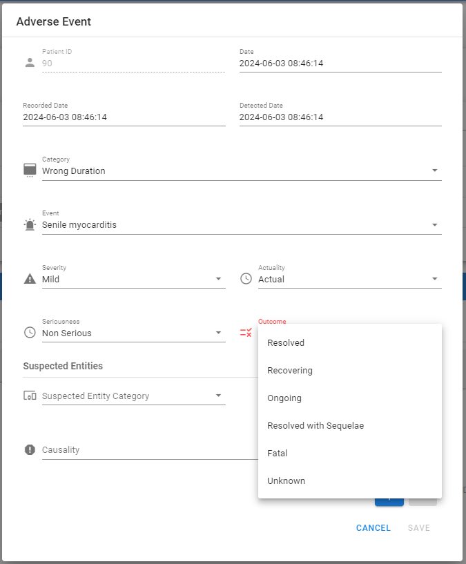

# Adverse events

The Adverse events tab is a feature for clinicians to record any actual or potential medical care, research study or other event causing physical injury. The tab is activated when the patient is officially enrolled in the project, it can show the past
adverse events linked to the patient and provide a form where the clinicians can modify or insert a 
new event, either actual or possible. The clinician are capable of inserting a suspect entity to be associated to
this type of event, the suspected entities can be either a device or a medication .

Follow the steps below to insert an adverse event:

1. In the patient's record, click on "Adverse Events" to open the Adverse Events tab
2. Click on +ADVERSE EVENT to open the Adverse Event form
3. Set the date, the recorded date and the detected date. **They are the dates when, respectively, the event has occurred, has been recorded and has been detected**
4. Click on "Category" and select an option from the dropdown menu. **Category is the overall categorization of the event, for instance product-related or situational**
5. Click on "Event", and select an option from the dropdown menu
6. Click on "Severity", and select an option from the dropdown menu. **Severity refers to the AE intensity**
7. Click on "Actuality", and select an option from the dropdown menu. **Actuality can be set either as real or potential**
8. Click on "Seriousness", and select an option from the dropdown menu. **Seriousness is based on patient/event outcome or action criteria**
9. Click on "Outcome", and select an option from the dropdown menu
10. Click on "Suspected Entity Category", and select an option from the dropdown menu
11. Click on "Suspected Entity", and select an option from the menu. **Only registered devices and medications will appear in the menu**
12. Click on "Causality", and select an option from the menu. 
13. Click on SAVE to save the data, otherwise click on CANCEL to discard them.

 <figure id="AE button" class="centered-figure">

<figcaption style="text-align:center">Step 1 </figcaption>
</figure>

<figure id="AE " class="centered-figure">

<figcaption style="text-align:center">The Adverse Events tab </figcaption>
</figure>

 <figure id="AE_create " class="centered-figure">

<figcaption style="text-align:center">Step 2 </figcaption>
</figure>

 <figure id="Form" class="centered-figure">

<figcaption style="text-align:center">The adverse Event form </figcaption>
</figure>

 <figure id="AE_date" class="centered-figure">

<figcaption style="text-align:center">Step 3: set the date </figcaption>
</figure>

 <figure id="recorded date" class="centered-figure">

<figcaption style="text-align:center">Step 3: set the recorded date</figcaption>
</figure>

 <figure id="detected date" class="centered-figure">

<figcaption style="text-align:center">Step 3: set the detected date </figcaption>
</figure>

 <figure id="category" class="centered-figure">

<figcaption style="text-align:center">Step 4 </figcaption>
</figure>

<figure id="category menu" class="centered-figure">

<figcaption style="text-align:center"></figcaption>
</figure>

 <figure id="event" class="centered-figure">

<figcaption style="text-align:center">Step 5</figcaption>
</figure>

<figure id="event menu" class="centered-figure">

<figcaption style="text-align:center"></figcaption>
</figure>

 <figure id="severity" class="centered-figure">

<figcaption style="text-align:center">Step 6 </figcaption>
</figure>

<figure id="severity menu" class="centered-figure">

<figcaption style="text-align:center"></figcaption>
</figure>

 <figure id="actuality" class="centered-figure">

<figcaption style="text-align:center">Step 7 </figcaption>
</figure>

<figure id="actuality menu" class="centered-figure">

<figcaption style="text-align:center"> </figcaption>
</figure>

 <figure id="seriousness" class="centered-figure">

<figcaption style="text-align:center">Step 8 </figcaption>
</figure>

<figure id="seriousness menu" class="centered-figure">

<figcaption style="text-align:center"> </figcaption>
</figure>

 <figure id="outcome" class="centered-figure">

<figcaption style="text-align:center">Step 9 </figcaption>
</figure>

<figure id="outcome menu" class="centered-figure">

<figcaption style="text-align:center"></figcaption>
</figure>

 <figure id="suspected" class="centered-figure">

<figcaption style="text-align:center">Step 10 </figcaption>
</figure>

<figure id="suspected menu" class="centered-figure">

<figcaption style="text-align:center"></figcaption>
</figure>

 <figure id="entity" class="centered-figure">

<figcaption style="text-align:center">Step 11</figcaption>
</figure>

<figure id="suspected entity" class="centered-figure">

<figcaption style="text-align:center"></figcaption>
</figure>

 <figure id="causality" class="centered-figure">

<figcaption style="text-align:center">Step 12 </figcaption>
</figure>

<figure id="causality menu" class="centered-figure">

<figcaption style="text-align:center"></figcaption>
</figure>

 <figure id="save" class="centered-figure">

<figcaption style="text-align:center">Step 13 </figcaption>
</figure>

 <figure id="save" class="centered-figure">

<figcaption style="text-align:center">Adverse event saved</figcaption>
</figure>