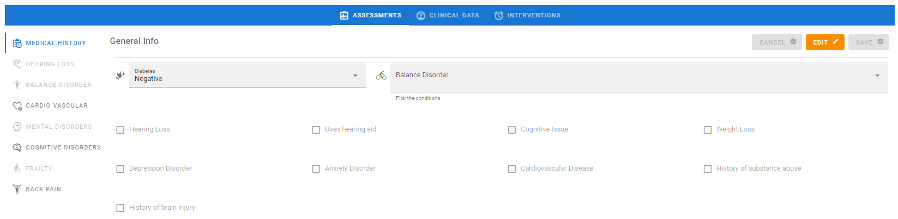
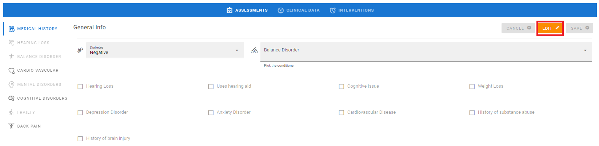
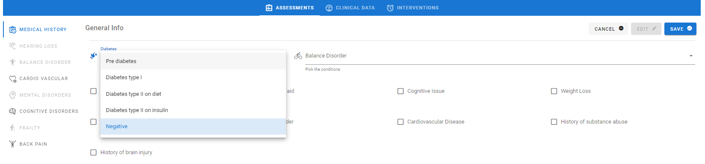
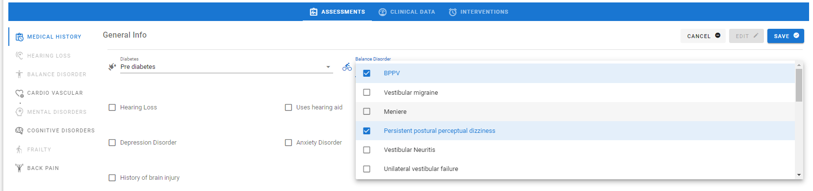
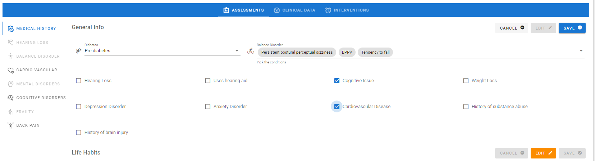
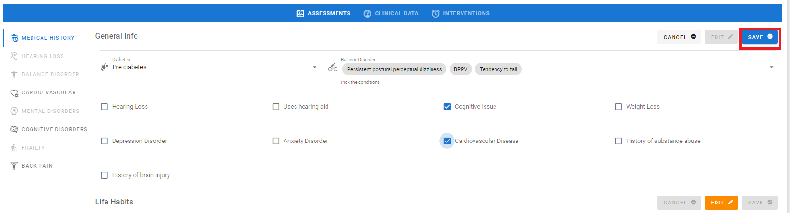

## Intro

After verifying the exclusion criteria are matched, two new buttons will appear in the patient’s record (see Figure ):

•	DEVICES MANAGEMENT which opens the Devices tab. This tab allows the user to view, insert and modify the information about the devices associated to a patient. (see Sec.) 
•	ID MANAGEMENT which opens the ID Management tab appears. This tab allows the user to view, insert and modify the IDs that are assigned to a patient in the context of the synergies with other projects, e.g. HOLOBalance and (only for the PoP) Smart4Health (see Sec. ).

<figure id="Pic_66" >

<figcaption style="text-align:center">Figure </figcaption>
</figure>

<figure id="Pic_67" >

<figcaption style="text-align:center">Figure </figcaption>
</figure>

To conduct the Baseline Assessment, click on SHOW to re-open the Assessment created to verify the exclusion criteria. The following buttons will appear:

•	MEDICAL HISTORY which opens the Medical History tab. This tab is active for all patients and the data concerning medical history (e.g. comorbidities, physical examinations) are saved here (see ). 
•	HEARING LOSS which opens the Hearing Loss tab. This tab must be activated with the patient profiling functionality and data concerning the specific Hearing Loss assessment are saved here (see sec. ).
•	BALANCE DISORDERS which opens the Balance Disorders tab. This tab must be activated with the patient profiling functionality and data concerning the specific Balance assessment are saved here (see sec. )
•	CARDIOVASCULAR which opens the Cardiovascular tab. This tab must be activated with the patient profiling functionality and data concerning the specific Cardiovascular Diseases assessment are saved here (see sec. ) 
•	MENTAL DISORDERS which opens the Mental Disorders tab. This tab must be activated with the patient profiling functionality and data concerning the specific Mental Disorders assessment are saved here (see sec. )
•	COGNITIVE DISORDERS which opens the Cognitive Disorders tab. This tab must be activated with the patient profiling functionality and data concerning the specific Cognitive Disorders assessment are saved here (see sec. )
•	FRAILTY which opens the Frailty tab. This tab must be activated with the patient profiling functionality and data concerning the specific Frailty assessment are saved here (see sec. ).

## Medical History

### General Info

The General Info tab is shown in Figure . 

Follow the steps below to fill it:
1.	Click on EDIT 
2.	Click on Diabetes (see Figure ), select a value from the menu (see Figure )
3.	Click on Balance Disorders (see Figure ) select the values from the menu (see Figure )
4.	According to the patient’s medical history, tick at least two comorbidities that are documented and will be monitored (see Figure ).
5.	If you have completed the form correctly click on SAVE to save the data, otherwise click on CANCEL to discard them

<figure id="Pic_67a" >

<figcaption style="text-align:center">Figure </figcaption>
</figure>

<figure id="Pic_68" >

<figcaption style="text-align:center">Figure </figcaption>
</figure>

<figure id="Pic_69" >

<figcaption style="text-align:center">Figure </figcaption>
</figure>

3. Tick the comorbidities
<figure id="Pic_70" >

<figcaption style="text-align:center">Figure </figcaption>
</figure>

4. Click on SAVE.

<figure id="Pic_71a" >

<figcaption style="text-align:center">Figure </figcaption>
</figure>

### Life Habits

The Life Habits (see Figure ) allows the user to insert and modify the following data to be collected from the patient:

•	Salt intake. Click on Salt intake and choose a value from the menu (see Figure )
•	Falls over the last 12 months. Type the value. 
•	Drinking. The alcohol intake in units/day is saved here. Click on Drinking and type the value.
•	Smoker status. Click on Smoker status and choose a value from the menu (see Figure )
•	Packs of cigarettes per month. If the patient is or has been a smoker, click on the label and type a value.

To fill the tab click on EDIT. If you have completed the form correctly click on SAVE to save the data, otherwise click on CANCEL to discard them.

<figure id="Pic_72" >

<figcaption style="text-align:center">Figure </figcaption>
</figure>

 

<figure id="Pic_70" >

<figcaption style="text-align:center">Figure </figcaption>
</figure>

### Physical Examinations

The Physical Examinations tab is shown in Figure and allows the user to insert and view the following data to be collected during the Baseline Assessment:

•	Height. Click on the label and type a value in cm.
•	Weight. Click on the label and type a value in kg.
•	Waist circumference. Click on the label and type a value in cm.
•	Hip circumference. Click on the label and type a value in cm.
•	Body Mass Index. Click on the label and type a value in kg/m2
•	Heart rate. Click on the label and type a value in beat/min.
•	Blood Pressure Misurations. The pressure measurements are reported here, including systolic and diastolic blood pressure, both supine and standing. First, select the arm on which the pressure was taken from the menu (see Figure ), then click on the labels and type the values in mmHg.

To fill the tab, click on EDIT. If you have completed the form correctly click on SAVE to save the data, otherwise click on CANCEL to discard them.

### Medications

The Medications tab is shown in Figure 109. The data concerning the medications are saved here, including the daily dose and intake frequency. Follow the steps below to fill it:  

1. Click on the +MEDICATION button (see Figure 110). The Register medication tab appears (see Figure ). 
2. Click on Medication. (see Figure 112) Type the medication name (see Figure ).  
3. If the medication is psychoactive, tick Psychoactive Medicine 
4. Click on Substance. Select the name of the active substance form the menu, or type it  
5. Click on Dosage form. Select a value from the menu 
6. Click on Dosage Direction. Select a value from the menu 
7. Click on Dose and type a value, or click on the buttons to increase or decrease the value. The dose amount must be complemented with the Unit of Measure, and can have decimal digits 
8. Click on Unit of Measure. (see Figure ).  Select a value from the menu. (see Figure ) 
9. Click on Frequency. Type a value (see Errore. L'origine riferimento non è stata trovata.). The amount must be complemented with the Period unit 
10. Click on Period unit. (see Figure ).  Select a value from the menu (see Figure ) 
11. Click on Period. Type a value (see Figure ) 
12. Click on When. (see Figure ). Select one or more values from the menu (Figure ) 
13. Click on Days of the week.  (see Figure ). Select one or more values from the menu (see Figure ) 
14. If you want to set more dosages, click on + and follow the steps from 6 to 10 again 
15. Select a date range, which is the duration of the prescription on the calendar. (see Figure ) 
16. Click on the REGISTER button to save the data, otherwise click on the CANCEL button to discard them (see Figure ). 

After registering a medication, it appears as a new record in the Medications tab. Also two new buttons appear, EDIT and DELETE, which allow respectively to modify and delete the data in a record (see Figure ).

### Diet Supplements 

The Diet Supplements tab is shown in Figure . Follow the steps below to fill it:

1. Click on  +DIET SUPPLEMENT button. The Register Medication form appears (see Figure and Figure )
2. Click on Diet Supplement, dropdown menu appears (see Figure ), select a value (see Figure )
3. Click on Dose, and type a value (see Figure )
4. Click on Unit of Measure, a dropdown menu appears (see Figure ), select a value (see Figure )
5. Click on REGISTER to save the data, otherwise click on CANCEL to discard them (see Figure ).

After the registration, the diet supplement appears as a record in the Diet Supplements tab. Also two new buttons appear, EDIT and DELETE, which allow respectively to modify and delete the data in a record (see Figure ).

### Questionnaires

The tab of Questionnaires is shown in Figure 137. It contains the questionnaires that must be administered to all the patients: Patient Specific Functional Scale (PSFP, only in Smart4Health), EQ-5D-5L, Mini Nutritional Assessment (MNA), Dexterity, Geriatric Depression Scale (GDS), MoCA, Instrumental Activities of Daily Living (IADL), Rapid Geriatric Assessment (RGA), Godin Leisure Time Exercise, Numeric Pain Rating Scale (only in Smart4Health), Global Perceived Effect (only in Smart4Health), Mobile Device Proficiency Questionnaire (MDPQ). 

To fill a questionnaire, click on +ADD to open the tab, select the responses and save the results (see section ). It is possible to open a curtain menu, which displays the responses. Also, the score is coloured according to the criticality: green is for good results, red is for critical results.

## Patient profiling

During the Baseline Assessment, a profiling functionality is available for the users to confirm which comorbidities will be monitored. There is an orange button in the lower right corner (see Figure ) which opens a form, where the proposed profile of the patient is shown (see Figure ): select/unselect the comorbidities to be monitored, then click on ACCEPT. Consequently, the specific assessment tabs will be activated according to the selection.

## Hearing Loss

Tick the Hearing Loss condition, or uses hearing aids in the tab Medical History, then confirm the patient's profile (see sec. ) to activate the Hearing Loss tab (see Figure ). Click on the HEARING LOSS button (see Figure ) to open the Hearing Loss tab (see Figure ). It is divided into two tabs:

1.	General Info. This tab is for saving the following data to be collected during the Audoligical examination:
o	Noise Exposure History. Click on the label and type a value in dB.
o	Tympanometry. Click on the label and type a value in daPa
o	Pure tone audiometry. Clik on the label and type a value in Pa
o	Otoscopy. Click on the label, then select a Abnormal or Normal from the menu.
2. Questionnaires. It contains the MoCA and the GHABP questionnaires. To fill a questionnaire, click on +ADD to open the tab, select the responses and save the results (see section ). It is possible to open a curtain menu, which displays the responses. Also, the score is coloured according to the criticality: green is for good results, red is for critical results.

To fill the General Info click on EDIT. If you have completed the form correctly click on SAVE to save the data, otherwise click on CANCEL to discard them.

### General Info

Follow the steps below to fill the General Info tab:

1. Click on the EDIT button (see Figure );
2. Click on and type a value in Noise Exposure History, Tympanometry and Pure Tone Audiometry. If
necessary, tick Family History of Hearing Loss (see Figure )
3. Click on Otoscopy and a dropdown menu appears. Select a value (see Figure and Figure )
4. Click on the SAVE button to save the data, otherwise click on the CANCEL button to discard them (see
Figure ).

## Balance Disorder

To activate the Balance Disorders tab, select a value under Balance Disorders in Medical History (see Figure ), then confirm the patient's profile (see sec. ). Click on BALANCE DISORDER (see Figure ), to open the tab (see Figure ). It features the following questionnaires: Fall Efficacy Scale International (FES-I), Activities Specific Balance Confidence Scale (ABC), Functional Gait Assessment (FGA), Mini-Balance Evaluation System Test (Mini-BEST), Rapid Assessment of Physical Activity (RAPA). To fill a questionnaire, click on +ADD to open the tab, select the responses and save the results (see section ). It is possible to open a curtain menu, which displays the responses. Also, the score is coloured according to the criticality: green is for good results, red is for critical results.

## Cardio Vascular

Tick the Cardiovascular condition in Medical History, then confirm the patient's profile (see sec. ) to activate the Cardiovascular tab. Click on CARDIOVASCULAR (see figure) to open the Cardiovascular tab (see figure). 

This tab is divided into the following tabs: 
•	General Info. Data concerning medical conditions are saved here (see figure).
•	Observations. Data collected during the physical examinations are saved here, i.e. Blood Pressure and Heart rate (see figure).
•	Cardiovascular history. Data concerning specific conditions are saved here, i.e. Atrial Fibrillation, Coronary Artery Disease, Hypertension, Heart Failure (see figure).
•	ECG. Data collected with ECG are saved here (see figure).
•	Cholesterol and scores. Data concerning cholesterol amount are saved here, and a link to a Heart Score calculator is provided (see figure).

### General Info

Follow the steps below to fill this tab:
1.	Click on EDIT 
2.	Click Type the requested values, i.e. Number of visits and Time spent doing Physical activity in min/week.
3.	Tick the checkbox for Sleep Disorder if necessary 
4.	Fill the box with Special Dietary Conditions if necessary
5.	Click on SAVE button to save the data, otherwise click on CANCEL to discard them.

### Cardiovascular History

Follow the steps below to fill the tab:

1.	Click on EDIT  
2.	Click on the Atrial Fibrillation and Coronary Artery Disease, select a value from the menus (see Figure , Figure , Figure ) . 
3.	If necessary, tick the checkboxes for one or more conditions.
4.	Click on SAVE to save the data, otherwise click on CANCEL to discard them.

### ECG

Follow the steps below to fill this tab:

1.	Click on EDIT  
2.	Click on PR Interval, QRS Interval, QTC Intervals and type the requested values in ms which appear on the ECG curve 
3.	Click on Rhythm, select a value from the menu (see Figure ). 
4.	Click on QRS Morphology, select a value from the menu (see Figure )
5.	Click on Peripheral arteries pulsation, select a value from the menu (see Figure )
6.	If necessary tick the Left ventricular hypertrophy checkbox
7.	Click on Cardiac Auscultation Finding, select a value from the menu (see Figure )
8.	If necessary tick the Audible murmurs checkbox (see Figure )
9.	If necessary tick the Ascites checkbox (see Figure )
10.	If necessary tick the Hepatomegaly/Splenomegaly checkbox (see Figure )
11.	Click on the SAVE to save the data, otherwise click on CANCEL to discard them (see figure ).

The ECG intervals are shown in sec. 8.1.

### Cholesterol and Scores

1.	Click on EDIT (see figure )
2.	Click on HB A1C level, type a value in % 
3.	Click on LDL Cholesterol, type a value in mg/dl
4.	Click on HDL Cholesterol, type a value in mg/dl
5.	The Heart Score can be calculated with an online tool. Click on Calculate (see Figure ) to open the webpage (see Figure )
6.	Click on SAVE to save the data, otherwise click on CANCEL to discard them.

## Mental Disorders

Tick the Anxiety or Depression disorder condition in Medical History (see Figure ), then confirm the patient's profile (see sec. ) to activate the Mental Disorders tab. Click on MENTAL DISORDERS (see Figure ), to open the Mental Disorders tab  (see Figure ). It features the following questionnaires: Single Item Sleep Quality Scale and GDS. To fill a questionnaire, click on +ADD to open the tab, select the responses and save the results (see section ). It is possible to open a curtain menu, which displays the responses. Also, the score is coloured according to the criticality: green is for good results, red is for critical results.

## Cognitive Disorders

The Cognitive Disorders tab is activated in the following cases: 

1.	MoCA score is under 22
2.	The user ticks Cognitive issue in Medical History (see Figure ).

First, confirm the patient's profile (see sec. ). Click on the COGNITIVE DISORDES button (see Figure ) to open the Cognitive Disorders tab (see Figure ). To fill the GDS questionnaire, click on +ADD to open the tab, select the responses and save the results (see section ). It is possible to open a curtain menu, which displays the responses. Also, the score is coloured according to the criticality: green is for good results, red is for critical results.

## Frailty

Tick Weight Loss in Medical History (see Figure ), then confirm the patient's profile (see sec. ) to activate the Frailty tab. Click on FRAILTY (see Figure) to open the Frailty tab appears (see Figure ) which includes the Edmonton Frailty Scale (EFS) questionnaire. To fill this questionnaire, click on +ADD to open the tab, select the responses and save the results (see section ). It is possible to open a curtain menu, which displays the responses. Also, the score is coloured according to the criticality: green is for good results, red is for critical results