## Intro

After verifying the exclusion criteria are matched, two new buttons will appear in the patient’s record:

•	DEVICES MANAGEMENT which opens the Devices tab. This tab allows the user to view, insert and modify the information about the devices associated to a patient.  
•	ID MANAGEMENT which opens the ID Management tab appears. This tab allows the user to view, insert and modify the IDs that are assigned to a patient in the context of the synergies with other projects, e.g. HOLOBalance and (only for the PoP) Smart4Health (see ).

To conduct the Baseline Assessment, click on SHOW to re-open the Assessment created to verify the exclusion criteria. The following buttons will appear:

•	MEDICAL HISTORY which opens the Medical History tab. This tab is active for all patients and the data concerning medical history (e.g. comorbidities, physical examinations) are saved here (see Medical History). 
•	HEARING LOSS which opens the Hearing Loss tab. This tab must be activated with the patient profiling functionality and data concerning the specific Hearing Loss assessment are saved here (see Hearing Loss).
•	BALANCE DISORDERS which opens the Balance Disorders tab. This tab must be activated with the patient profiling functionality and data concerning the specific Balance assessment are saved here (see Balance Disorders)
•	CARDIOVASCULAR which opens the Cardiovascular tab. This tab must be activated with the patient profiling functionality and data concerning the specific Cardiovascular Diseases assessment are saved here (see Cardiovascular) 
•	MENTAL DISORDERS which opens the Mental Disorders tab. This tab must be activated with the patient profiling functionality and data concerning the specific Mental Disorders assessment are saved here (see Mental Disorders)
•	COGNITIVE DISORDERS which opens the Cognitive Disorders tab. This tab must be activated with the patient profiling functionality and data concerning the specific Cognitive Disorders assessment are saved here (see Cognitive Disorders) 
•	FRAILTY which opens the Frailty tab. This tab must be activated with the patient profiling functionality and data concerning the specific Frailty assessment are saved here (see Frailty ).

## Medical History

### General Info

The General Info tab is shown in Figure . 

Follow the steps below to fill it:
1.	Click on EDIT 
2.	Click on Diabetes, select a value from the menu 
3.	Click on Balance Disorders select the values from the menu 
4.	According to the patient’s medical history, tick at least two comorbidities that are documented and will be monitored .
5.	If you have completed the form correctly click on SAVE to save the data, otherwise click on CANCEL to discard them

<figure id="Pic 1" >

<figcaption style="text-align:center"></figcaption>
</figure>

<figure id="Pic 3" >

<figcaption style="text-align:center"></figcaption>
</figure>

<figure id="Pic 5" >

<figcaption style="text-align:center"></figcaption>
</figure>

<figure id="Pic 6" >

<figcaption style="text-align:center"></figcaption>
</figure>

### Life Habits
To fill the tab click on EDIT.

<figure id="Pic 8" >

<figcaption style="text-align:center"></figcaption>
</figure>

The Life Habits allows the user to insert and modify data on life Habits to be collected from the patient:

•	Salt intake. Click on Salt intake and choose a value from the menu 
•	Falls over the last 12 months. Type the value. 
•	Drinking. The alcohol intake in units/day is saved here. Click on Drinking and type the value.
•	Smoker status. Click on Smoker status and choose a value from the menu 
•	Packs of cigarettes per month. If the patient is or has been a smoker, click on the label and type a value.

<figure id="Pic 9" >

<figcaption style="text-align:center"></figcaption>
</figure>

<figure id="Pic 11" >

<figcaption style="text-align:center"></figcaption>
</figure>

<figure id="Pic 12" >

<figcaption style="text-align:center"></figcaption>
</figure>

 If you have completed the form correctly click on SAVE to save the data, otherwise click on CANCEL to discard them.

<figure id="Pic 12" >

<figcaption style="text-align:center"></figcaption>
</figure>
 

### Physical Examinations
To fill the tab, click on EDIT.

<figure id="Pic 13" >

<figcaption style="text-align:center"></figcaption>
</figure>

The Physical Examinations tab allows the user to insert and view the following data to be collected during the Baseline Assessment:

•	Height. Click on the label and type a value in cm.
•	Weight. Click on the label and type a value in kg.
•	Waist circumference. Click on the label and type a value in cm.
•	Hip circumference. Click on the label and type a value in cm.
•	Body Mass Index. Click on the label and type a value in kg/m2
•	Heart rate. Click on the label and type a value in beat/min.
•	Blood Pressure Misurations. The pressure measurements are reported here, including systolic and diastolic blood pressure, both supine and standing. First, select the arm on which the pressure was taken from the menu ( then click on the labels and type the values in mmHg.

<figure id="Pic 14" >

<figcaption style="text-align:center"></figcaption>
</figure>

If you have completed the form correctly click on SAVE to save the data, otherwise click on CANCEL to discard them.

<figure id="Pic 14a" >

<figcaption style="text-align:center"></figcaption>
</figure>

### Medications

The Medications tab is shown in Figure 109. 
The data concerning the medications are saved here, including the daily dose and intake frequency. Follow the steps below to fill it:  

```mermaid
graph TD;
    Start(START)-->
    ClickPlusMed(1. Click on +MEDICATION <br>to open Medication Tab);
    ClickPlusMed--See figure 110-->Register[The Register medication tab appears]
    Register--See figure -->SelectMed(2. Click on Medication <br> Select a value from the menu);
    SelectMed--See figure 112-->Medication[Type the medication name];
    Medication--See figure-->TypeDose(3. If the medication is psychoactive, <br> tick Psychoactive Medicine);
    TypeDose-->SelectUnitMeasure(4. Click on Substance <br> Select the name of the active <br> substance form the menu, or type it);
    SelectUnitMeasure-->TickPsychoactive(5. Click on Dosage form <br> Select a value from the menu );
    TickPsychoactive-->TypeFrequency(6. Click on Dosage Direction <br> Select a value from the menu );
    TypeFrequency-->SelectPeriodUnit(7. Click on Dose and type a value,<br> or Click on the buttons to increase or decrease the value);
    DoseButton[<br> The dose amount must be complemented <br> with the Unit of Measure, and can have decimal digits]
    SelectPeriodUnit-->DoseButton[The dose amount must be complemented <br> with the Unit of Measure, and can have decimal digits]
    DoseButton-->TypePeriod(8. Click on Unit of Measure);
    TypePeriod--See figure-->SelectVal[Select a value from the menu];
    SelectVal--See figure-->SelectWhen(9. Click on Frequency <br> Type a value);
    SelectWhen-->AmountFreq[The amount must be complemented <br> with the Period unit]
    AmountFreq--See Errore L'origine riferimento non è stata trovata-->SelectDosageDirection(10. Click on Period unit);
    SelectDosageDirection--See figure-->ValFromMenu[Select a value from the menu]
    ValFromMenu--See figure-->SelectDateRange(11. Click on Period <br> Type a value);
    SelectDateRange--See figure-->OnWhen(12.  Click on When. <br>);
    OnWhen--See figure-->When[Select one or more <br> values from the menu];
    When-- See Figure-->Day(13. Click on Days of the week)
    Day--See figure-->ValDay[Select one or more <br> values from the menu]
    ValDay--See figure-->MoreDosages{14. Do you want to <br> set more dosages?}-->
   Yes-->Plus[Click on + and follow the <br> steps from 6 to 10 again]-->TypeFrequency
    MoreDosages--->No-->DateRange(15. Select a date range, which is the duration <br> of the prescription on the calendar.)
    DateRange --See figure-->RegisterFinal(16. Click on the REGISTER button to save the data, <br> otherwise Click on the CANCEL button to discard them)
RegisterFinal--See figure-->End(END)
```

After registering a medication, it appears as a new record in the Medications tab. Also two new buttons appear, **EDIT** and **DELETE**, which allow respectively to modify and delete the data in a record (see Figure ).

The data concerning the medications are saved here, including the daily dose and intake frequency. 

<figure id="Pic 15" >

<figcaption style="text-align:center"></figcaption>
</figure>

Follow the steps below to insert a medication record:  

1. Click on the +MEDICATION button to open the Register medication tab.
   
<figure id="Pic 16" >

<figcaption style="text-align:center"></figcaption>
</figure>

<figure id="Pic 17" >

<figcaption style="text-align:center"></figcaption>
</figure>

2. Click on Medication. Type the medication name.  
3. If the medication is psychoactive, tick Psychoactive Medicine 
4. Click on Substance. Select the name of the active substance form the menu, or type it  

<figure id="Pic 18" >

<figcaption style="text-align:center"></figcaption>
</figure>

<figure id="Pic 19" >

<figcaption style="text-align:center"></figcaption>
</figure>

5. Click on Concentration unit. Select a value from the menu
6. Type the concentration

<figure id="Pic 20" >

<figcaption style="text-align:center"></figcaption>
</figure>

<figure id="Pic 21" >

<figcaption style="text-align:center"></figcaption>
</figure>

<figure id="Pic 22" >

<figcaption style="text-align:center"></figcaption>
</figure>

7. Click on Dosage form. Select a value from the menu 
8. Click on Dosage Direction. Select a value from the menu 

<figure id="Pic 23" >

<figcaption style="text-align:center"></figcaption>
</figure>

<figure id="Pic 24" >

<figcaption style="text-align:center"></figcaption>
</figure>

9. Click on Dose and type a value, or click on the buttons to increase or decrease the value. The dose amount must be complemented with the Unit of Measure, and can have decimal digits 
10. Click on Unit of Measure.  Select a value from the menu.  

<figure id="Pic 25" >

<figcaption style="text-align:center"></figcaption>
</figure>

<figure id="Pic 26" >

<figcaption style="text-align:center"></figcaption>
</figure>

11. Click on Frequency. Type a value. The amount must be complemented with the Period unit 
12. Click on Period unit.  Select a value from the menu 
13. Click on Period. Type a value 

<figure id="Pic 27" >

<figcaption style="text-align:center"></figcaption>
</figure>

<figure id="Pic 28" >

<figcaption style="text-align:center"></figcaption>
</figure>

14. Click on When. Select one or more values from the menu
15. Click on Days of the week. Select one or more values from the menu 

<figure id="Pic 29" >

<figcaption style="text-align:center"></figcaption>
</figure>

<figure id="Pic 30" >

<figcaption style="text-align:center"></figcaption>
</figure>

16. If you want to set more dosages, click on + and follow the steps from 6 to 15 again

<figure id="Pic 31" >

<figcaption style="text-align:center"></figcaption>
</figure>

18. Select a date range, which is the duration of the prescription on the calendar. 
19. Click on the REGISTER button to save the data, otherwise click on the CANCEL button to discard them. 

<figure id="Pic 31a" >

<figcaption style="text-align:center"></figcaption>
</figure>

After registering a medication, it appears as a new record in the Medications tab. Also two new buttons appear, **EDIT** and **DELETE**, which allow respectively to modify and delete the data in a record (see Figure ).

<figure id="Pic 32" >

<figcaption style="text-align:center"></figcaption>
</figure>

### Diet Supplements 

Data concerning diet supplements are saved here. 

<figure id="Pic 33" >

<figcaption style="text-align:center"></figcaption>
</figure>

Follow the steps below to insert a record:

1. Click on +DIET SUPPLEMENT button. The Register Diet supplement tab appears. 

<figure id="Pic 34" >

<figcaption style="text-align:center"></figcaption>
</figure>

<figure id="Pic 35" >

<figcaption style="text-align:center"></figcaption>
</figure>

2. Click on Diet supplement, select a value from the menu  
3. Click on Dosage form. Select a value from the menu 
4. Click on Dosage Direction. Select a value from the menu 

<figure id="Pic 36" >

<figcaption style="text-align:center"></figcaption>
</figure>

<figure id="Pic 37" >

<figcaption style="text-align:center"></figcaption>
</figure>

<figure id="Pic 38" >

<figcaption style="text-align:center"></figcaption>
</figure>

5. Click on Dose and type a value, or click on the buttons to increase or decrease the value. The dose amount must be complemented with the Unit of Measure, and can have decimal digits 
6. Click on Unit of Measure.  Select a value from the menu.  

<figure id="Pic 39" >

<figcaption style="text-align:center"></figcaption>
</figure>

7. Click on Frequency. Type a value. The amount must be complemented with the Period unit 
8. Click on Period unit.  Select a value from the menu 
9. Click on Period. Type a value 

<figure id="Pic 40" >

<figcaption style="text-align:center"></figcaption>
</figure>

10. Click on When. Select one or more values from the menu  
11. Click on Days of the week.  Select one or more values from the menu 

<figure id="Pic 40" >

<figcaption style="text-align:center"></figcaption>
</figure>

<figure id="Pic 41" >

<figcaption style="text-align:center"></figcaption>
</figure>

12. If you want to set more dosages, click on + and follow the steps above again 
13. Select a date range, which is the duration of the prescription on the calendar 

<figure id="Pic 42" >

<figcaption style="text-align:center"></figcaption>
</figure>

14. Click on the REGISTER button to save the data, otherwise click on the CANCEL button to discard them. 

<figure id="Pic 43" >

<figcaption style="text-align:center"></figcaption>
</figure>

After the registration, the diet supplement appears as a record in the Diet Supplements tab. Also two new buttons appear, EDIT and DELETE, which allow respectively to modify and delete the data in a record (see Figure ).

### Questionnaires

This tab provides the questionnaires that must be administered to all the patients: Patient Specific Functional Scale (PSFP, only in Smart4Health), EQ-5D-5L, Mini Nutritional Assessment (MNA), Dexterity, Geriatric Depression Scale (GDS), MoCA, Instrumental Activities of Daily Living (IADL), Rapid Geriatric Assessment (RGA), Godin Leisure Time Exercise, Numeric Pain Rating Scale (only in Smart4Health), Global Perceived Effect (only in Smart4Health), Mobile Device Proficiency Questionnaire (MDPQ). 

To fill a questionnaire, click on +ADD to open the tab, select the responses and save the results (see section ). It is possible to open a curtain menu, which displays the responses. Also, the score is coloured according to the criticality: green is for good results, red is for critical results.

<figure id="Pic 43a" >

<figcaption style="text-align:center"></figcaption>
</figure>

