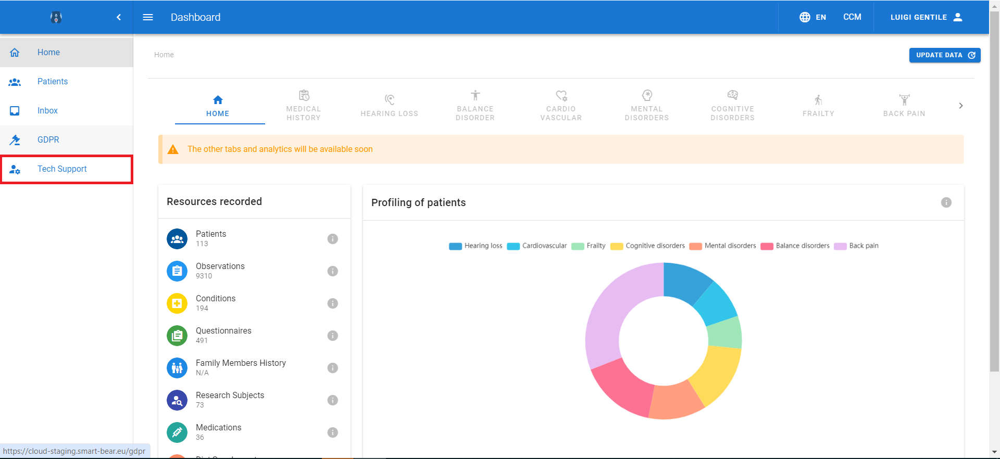

# Device Management

Click on DEVICE MANAGEMENT in a patient's record to open the Devices tab. 

 <figure id="Pic 10">

<figcaption style="text-align:center"></figcaption>
</figure>

 <figure id="Pic 11">

<figcaption style="text-align:center"></figcaption>
</figure>

 Data concerning the devices and their status are saved here. A record can be generated for all the devices, and data include the following attributes: Unique Identifier (a unique number that is assigned to a device), Category (for example Smartphone, Smartwatch etc.) and Status (Active, Inactive or Suspended). 

 The tab also features the following buttons:

•	+DEVICE. It opens the Assign Device form that is meant for assigning a device to a patient
•	EDIT. It opens the Modify Device form that is meant for the user to modify a device 
•	DELETE. It deletes a device.

## Device creation

Follow the steps below to assign a device to a patient:

1.	Click on +DEVICE to open Assign Device form. 
2.	Click the Unique ID and type the device ID (**Note: the smartphone ID must be the same IMEI as it is inserted in the SB app, otherwise the data transfer from the smartphone to the cloud may fail**)
3.	Click on the Status, and select a value from the menu 
4.	Click on Category type, and select a value from the menu (**Note: the available types will depend on the selected profiles. For example, the smart scale is only available for patients with cardiovascular diseases**)
5.	Click on the Number and type the number 
6.	Click on CREATE DEVICE to save the data, otherwise click on the CANCEL button to discard them.

 <figure id="Pic 11a" >

<figcaption style="text-align:center">Assign device: step 1</figcaption>
</figure>

 <figure id="Pic 12" >

<figcaption style="text-align:center">Assign Device tab</figcaption>
</figure>

 <figure id="Pic 14" >

<figcaption style="text-align:center">Assign Device: steps 2 and 3</figcaption>
</figure>

 <figure id="Pic 16" >

<figcaption style="text-align:center">Assign Device: step 4 </figcaption>
</figure>

 <figure id="Pic 17" >

<figcaption style="text-align:center">Assign Device: steps 5 and 6 </figcaption>
</figure>

**Note: to ensure all data are transmitted correctly to the SB cloud, insert all the devices that are assigned to a patient**

## Device editing
To modify a device, click on EDIT to open the Modify Device form. Click on MODIFY DEVICE to save the changes, otherwise click on CANCEL to discard the modifications.

 <figure id="Pic 17a" >

<figcaption style="text-align:center">Modify Device: step 1</figcaption>
</figure>

 <figure id="Pic 18" >

<figcaption style="text-align:center"> Modify Device form</figcaption>
</figure>

 <figure id="Pic 19" >

<figcaption style="text-align:center">Modify Device: click to accept a the changes</figcaption>
</figure>

## Inactivity monitoring

The Tech Support page provides functionalites to clinical and technical personnel for monitoring the ways the
devices function. Click on the Tech Support button to open the page, where the inactivity time of all the monitored patients is displayed. 

 <figure id="Pic 19" >

<figcaption style="text-align:center"></figcaption>
</figure>

 <figure id="Pic 19" >

<figcaption style="text-align:center"></figcaption>
</figure>

If you need to dive into details of a patient's inactivity click on the SHOW button to open the OVERVIEW interface, where the inactivity time of each device is shown.

 <figure id="Pic 19" >

<figcaption style="text-align:center"></figcaption>
</figure>

 <figure id="Pic 19" >

<figcaption style="text-align:center"></figcaption>
</figure>

A set of symbols detects the severity of the inactivity time, more in detail:

1. Green: less than three days inactive
2. Yellow: between three and 12 days inactive
3. Red: more then than 12 days inactive

Also, the No Info alert appears when the platform has not yet received data from one or all the devices a patient has received.

Each device record features a SHOW button to click for visualizing the data metrics.

 <figure id="Pic 19" >

<figcaption style="text-align:center"></figcaption>
</figure>

 <figure id="Pic 19" >

<figcaption style="text-align:center"></figcaption>
</figure>

From these tabs, you can also click on the DEVICES MANAGEMENT and ID MANAGEMENT buttons, which redirect to the respective pages.

