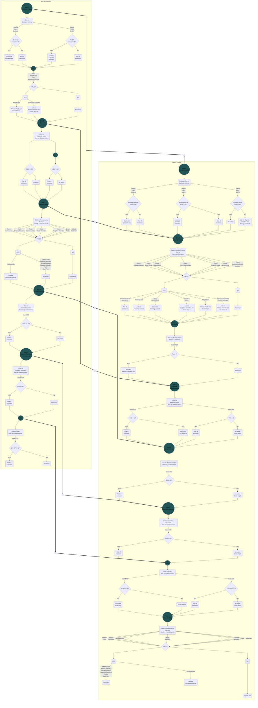

## Recruitment process

```mermaid

graph TB
subgraph Risk of exclusion
AStep1((Step 1: <br>Exclusion Criteria))
BStep1a(Click on <br>Exclusion criteria)


AStep1-->BStep1a
BStep1a--Step1a<br>Insert <br>Dexterity-->GStep1a
BStep1a--Step1b<br>Insert <br>MoCA-->GStep1b

GStep1a{Dexterity <br> Score < 4?}
GStep1b{MoCA <br> Score > 18?}

GStep1a--YES-->YesStep1a(Do MoCA <br>questionnaire)
GStep1a--NO-->NoStep1a(Risk of<br> exclusion)

GStep1b--YES-->YesStep1b(Assess <br>Cognitive <br>Disorders)
GStep1b--NO-->NoStep1b(Risk of<br> exclusion)

YesStep1a-->AStep2
NoStep1a-->AStep2
YesStep1b-->AStep2
NoStep1b-->AStep2

AStep2((Step 2))
GStep2{TRUE?}
AStep2--Check <br>Weight Loss<br>and<br>Depression Disorder    -->GStep2

GStep2-->YesStep2(YES)
GStep2-->NoStep2(NO)


YesStep2--Weight Loss-->YesStep2a(Activate Frailty tab<br>                          Go to step 13)
NoStep2-->NoActStep2(No action)

YesStep2--Depression Disorder-->YesStep2b(Activate <br>Mental Disordes tab<br>Go to step 12)

AStep3((Step 3:<br>General<br>Questionnaires))
YesStep2a-->AStep3
YesStep2b-->AStep3
NoActStep2-->AStep3

AStep3-->BStep3(Click on <br>Medical History<br>then on Questionnaires)
BStep3---->GStep3
BStep3---->AStep4((Step 4))-->GStep4
GStep3{GDS >= 12?}
GStep4{IADL <= 2?}

GStep3-->YesStep3(Risk of<br> exclusion)
GStep3-->NoStep3(No action)

GStep4-->YesStep4(Risk of<br> exclusion)
GStep4-->NoStep4(No action)

YesStep3-->AStep5 
NoStep3-->AStep5 
YesStep4-->AStep5 
NoStep4-->AStep5

AStep5((Step 5:<br>Patient Profiling))
AStep5-->BStep5(Click on Assessments<br>then on<br>Modify a Patient's profile)

GStep5{TRUE?} 


BStep5--Check<br>Hearing Loss-->GStep5
BStep5--Check<br>Balance Disorders-->GStep5
BStep5--Check<br>Cardiovascular-->GStep5
BStep5--Check<br>Mental Disorders-->GStep5
BStep5--Check<br>Cognitive Disorders-->GStep5
BStep5--Check<br>Frailty-->GStep5
BStep5--Check<br>Back Pain-->GStep5

GStep5-->YesStep5(YES)
GStep5-->NoStep5(NO)


YesStep5--Cardivascular-->ActStep5(Activate<br>Cardiovascular tab)
YesStep5--Hearing Loss<br>Balance Disorders<br>Mental Disorders<br>Cognitive Disorders<br>Frailty<br>Back Pain                        -->NoActionStep5(No action)
NoStep5-->DisStep5(Disable tab)

ActStep5-->AStep6
DisStep5-->AStep6
NoActionStep5-->AStep6

AStep6((Step 6:<br>Mental Disorders))
AStep6-->BStep6(Click on <br>Mental Disorders<br> then on Questionnaires)
BStep6--Insert GDS-->CStep6{GDS >= 12?}
CStep6--YES-->YesStep6(Risk of <br> exclusion)
CStep6--NO-->NoStep6(No action)

YesStep6-->AStep7
NoStep6-->AStep7

AStep7((Step 7:<br> Cognitive Disorders<br>Assessment))
AStep7-->BStep7(Click on <br>Cognitive Disorders<br> then on Questionnaires)
BStep7--Insert GDS-->CStep7{GDS >= 12?}
CStep7--YES-->YesStep7(Risk of <br> exclusion)
CStep7--NO-->NoStep7(No action)

YesStep7-->AStep8
NoStep7-->AStep8

AStep8((Step 8: <br>Frailty))
AStep8-->BStep8(Click on Frailty<br>then on Questionnaires)
BStep8--Insert EFS-->CStep8{12<=EFS<=17}
CStep8--YES-->YesStep8(Risk of <br> exclusion)
CStep8--NO-->NoStep8(No action)

%% set linkStyle
linkStyle default interpolate linear

style AStep1 fill:#255, stroke:#FFFFFF,stroke-width:2px, color:#000000;
style AStep2 fill:#255, stroke:#FFFFFF,stroke-width:2px, color:#000000;
style AStep3 fill:#255, stroke:#FFFFFF,stroke-width:2px, color:#000000;
style AStep4 fill:#255, stroke:#FFFFFF,stroke-width:2px, color:#000000;
style AStep5 fill:#255, stroke:#FFFFFF,stroke-width:2px, color:#000000;
style AStep6 fill:#255, stroke:#FFFFFF,stroke-width:2px, color:#000000;
style AStep7 fill:#255, stroke:#FFFFFF,stroke-width:2px, color:#000000;
style AStep8 fill:#255, stroke:#FFFFFF,stroke-width:2px, color:#000000;
end 


%% Change the color of the link 
AStep1<==>Link1<==>ProfilingAStep1 
AStep3<==>Link2<==>ProfilingAStep5
AStep5<==>Link3<==>ProfilingAStep2
AStep6<==>Link4<==>ProfilingAStep6
AStep7<==>Link5<==>ProfilingAStep7
AStep8<==>Link6<==>ProfilingAStep8

Link1((=))
Link2((=))
Link3((=))
Link4((=))
Link5((=))
Link6((=))


subgraph Patient Profiling
ProfilingAStep1((Step 1: <br>Exclusion Criteria))
ProfilingBStep1a(Profiling Click on <br>Exclusion criteria)

ProfilingAStep1-->ProfilingBStep1a
ProfilingBStep1a--Step1a<br>Insert <br>Dexterity-->ProfilingGStep1a
ProfilingBStep1a--Step1b<br>Insert <br>MoCA-->ProfilingGStep1b
ProfilingBStep1a--Step1c<br>Insert <br>MoCA-->ProfilingGStep1c

ProfilingGStep1a{Profiling Dexterity <br> Score < 4?}
ProfilingGStep1b{Profiling MoCA <br> Score > 18?}
ProfilingGStep1c{Profiling MoCA <br> Score > 26?}

ProfilingGStep1a--YES-->ProfilingYesStep1a(Do MoCA <br>questionnaire)
ProfilingGStep1a--NO-->ProfilingNoStep1a(Risk of<br> exclusion)

ProfilingGStep1b--YES-->ProfilingYesStep1b(Assess <br>Cognitive <br>Disorders)
ProfilingGStep1b--NO-->ProfilingNoStep1b(Risk of<br> exclusion)

ProfilingGStep1c--YES-->ProfilingNoActionStep1c(No action)
ProfilingGStep1c--NO-->ProfilingActStep1c(Activate Cognitive <br> Disorders tab,<br> then go to step 8)

ProfilingYesStep1a-->ProfilingAStep2
ProfilingNoStep1a-->ProfilingAStep2
ProfilingYesStep1b-->ProfilingAStep2
ProfilingNoStep1b-->ProfilingAStep2
ProfilingNoActionStep1c-->ProfilingAStep2
ProfilingActStep1c-->ProfilingAStep2

ProfilingAStep2((Step 2:<br>Medical History))
ProfilingAStep2-->ProfilingBStep2(Click on Medical History<br>then on<br>General Information)

ProfilingGStep2{TRUE?} 


ProfilingBStep2--Check<br>Substance abuse-->ProfilingGStep2
ProfilingBStep2--Check<br>Brain injury-->ProfilingGStep2
ProfilingBStep2--Check<br>Hearing Loss-->ProfilingGStep2
ProfilingBStep2--Check<br>Uses Hearing Aids-->ProfilingGStep2
ProfilingBStep2--Check<br>Cognitive Issue-->ProfilingGStep2
ProfilingBStep2--Check<br>Weight Loss-->ProfilingGStep2
ProfilingBStep2--Check<br>Depression/Anxiety<br> Disorder-->ProfilingGStep2

ProfilingGStep2-->ProfilingYesStep2(YES)
ProfilingGStep2-->ProfilingNoStep2(NO)

ProfilingYesStep2--Substance abuse<br>Brain injury<br>-->ProfilingRiskStep2(Risk of<br>exclusion)
ProfilingYesStep2--Hearing Loss-->ProfilingHearingLoss(Activate <br>Hearing Loss tab)
ProfilingYesStep2--Uses <br> Hearing Aids-->ProfilingHearingAids(Dectivate <br>Hearing Loss tab)
ProfilingYesStep2--Cognitive<br>Issue-->ProfilingCognitiveIssue(Activate <br> Cognitive Disorders tab<br>Go to step 8)
ProfilingYesStep2--Weight Loss-->ProfilingWeightLoss(Activate Frailty tab,<br> Go to Step 9)
ProfilingYesStep2--Depression Disorder <br> Anxiety Disorder-->ProfilingDisorders(Activete <br> Mental Disorder tab<br> Go to step 7)

ProfilingNoStep2-->ProfilingNoActStep2(No action)

ProfilingNoActStep2-->ProfilingAStep3((Step 3: <br> Life Habits))
ProfilingRiskStep2-->ProfilingAStep3
ProfilingHearingLoss-->ProfilingAStep3
ProfilingHearingAids-->ProfilingAStep3
ProfilingCognitiveIssue-->ProfilingAStep3
ProfilingWeightLoss-->ProfilingAStep3
ProfilingDisorders-->ProfilingAStep3

ProfilingAStep3-->ProfilingBStep3(Click on Medical History <br> then on Life Habits)
ProfilingBStep3--Insert Habits-->ProfilingCStep3{Falls>0?}
ProfilingCStep3--YES-->ProfilingYesStep3(Activate <br> Balance Disorders tab)
ProfilingCStep3--NO-->ProfilingNoStep3(No action)

ProfilingYesStep3-->ProfilingAStep5
ProfilingNoStep3-->ProfilingAStep5

ProfilingAStep5((Step 5: <br>General <br>Questionnaires))
ProfilingAStep5-->ProfilingBStep5(Click on<br>Medical History <br> then on Questionnaries)
ProfilingBStep5--Insert GDS-->ProfilingGDSStep5{GDS>=12?}
ProfilingBStep5--Insert IADL-->ProfilingIADLStep5{IADL<=2}

ProfilingRiskStep5a(Risk of<br>exclusion)
ProfilingRiskStep5b(Risk of<br>exclusion)
ProfilingNoActStep5a(No action<br>Go to step 9)
ProfilingNoActStep5b(No action<br>Go to step 9)

ProfilingGDSStep5--YES-->ProfilingRiskStep5a
ProfilingIADLStep5--YES-->ProfilingRiskStep5b
ProfilingGDSStep5--NO-->ProfilingNoActStep5a
ProfilingIADLStep5--NO-->ProfilingNoActStep5b

ProfilingRiskStep5a-->ProfilingAStep6
ProfilingRiskStep5b-->ProfilingAStep6
ProfilingNoActStep5a-->ProfilingAStep6
ProfilingNoActStep5b-->ProfilingAStep6

ProfilingAStep6((Step 6:<br>Mental Disorders))
ProfilingAStep6-->ProfilingBStep6(Click on Mental Disorders<br>then on Questionnaires)
ProfilingBStep6--Insert GDS-->ProfilingCStep6{GDS>=12?}
ProfilingCStep6--YES-->ProfilingYesStep6(Risk of<br>exclusion)
ProfilingCStep6--NO-->ProfilingNoStep6(No action<br>Go to step 9)

ProfilingYesStep6-->ProfilingAStep7
ProfilingNoStep6-->ProfilingAStep7

ProfilingAStep7((Step 7:<br>Cognitive Disorders))
ProfilingAStep7-->ProfilingBStep7(Click on Cognitive Disorders<br> then on Questionnaires)
ProfilingBStep7--Insert GDS-->ProfilingCStep7{GDS>=12?}
ProfilingCStep7--YES-->ProfilingYesStep7(Risk of<br>exclusion)
ProfilingCStep7--NO-->ProfilingNoStep7(No action<br>Go to step 9)

ProfilingYesStep7-->ProfilingAStep8
ProfilingNoStep7-->ProfilingAStep8

ProfilingAStep8((Step 8:<br>Frailty))
ProfilingAStep8-->ProfilingBStep8(Click on Frailty<br>then on Questionnaires)
ProfilingBStep8--Insert EFS-->ProfilingCStep8a{0<=EFS<=5?}
ProfilingBStep8--Insert EFS-->ProfilingCStep8b{12<=EFS<=17?}

ProfilingCStep8a--YES-->ProfilingYesStep8a(Deactivate<br>Frailty tab)
ProfilingCStep8a--NO-->ProfilingNoStep8a(Go to Step 8b)
ProfilingCStep8b--YES-->ProfilingYesStep8b(Risk of<br>exclusion)
ProfilingCStep8b--NO-->ProfilingNoStep8b(No action <br>Go to step 9)

ProfilingYesStep8a-->ProfilingAStep9
ProfilingYesStep8b-->ProfilingAStep9
ProfilingNoStep8a-->ProfilingAStep9
ProfilingNoStep8b-->ProfilingAStep9

ProfilingAStep9((Step 9:<br>Patient Profiling))
ProfilingAStep9-->ProfilingBStep9(Click on Assessments<br>then on <br> Modify a Patient's profile)

ProfilingCStep9{TRUE?}

ProfilingBStep9--Hearing<br>Loss-->ProfilingCStep9
ProfilingBStep9--Balance<br>Disorders-->ProfilingCStep9
ProfilingBStep9--Cardiovascular-->ProfilingCStep9
ProfilingBStep9--Mental<br>Disorders-->ProfilingCStep9
ProfilingBStep9--Cognitive<br>Disorders-->ProfilingCStep9
ProfilingBStep9--Frailty-->ProfilingCStep9
ProfilingBStep9--Back Pain-->ProfilingCStep9

ProfilingCStep9--->ProfilingYesStep9(YES)
ProfilingCStep9--->ProfilingNoStep9(NO)

ProfilingYesStep9--Hearing Loss<br>Balance Disorders<br>Mental Disorders<br>Cognitive Disorders<br>Frailty<br>Back Pain-->ProfilingNoActStep9(No action)
ProfilingYesStep9--Cardiovascular-->ProfilingActStep9(Activate <br>Cardiovascular tab)
ProfilingNoStep9---->ProfilingDisStep9(Disable tab)

%% set linkStyle
linkStyle default interpolate linear

style ProfilingAStep1 fill:#255, stroke:#FFFFFF,stroke-width:2px, color:#000000;
style ProfilingAStep2 fill:#255, stroke:#FFFFFF,stroke-width:2px, color:#000000;
style ProfilingAStep3 fill:#255, stroke:#FFFFFF,stroke-width:2px, color:#000000;
style ProfilingAStep5 fill:#255, stroke:#FFFFFF,stroke-width:2px, color:#000000;
style ProfilingAStep6 fill:#255, stroke:#FFFFFF,stroke-width:2px, color:#000000;
style ProfilingAStep7 fill:#255, stroke:#FFFFFF,stroke-width:2px, color:#000000;
style ProfilingAStep8 fill:#255, stroke:#FFFFFF,stroke-width:2px, color:#000000;
style ProfilingAStep9 fill:#255, stroke:#FFFFFF,stroke-width:2px, color:#000000;

end

```

## Intro

