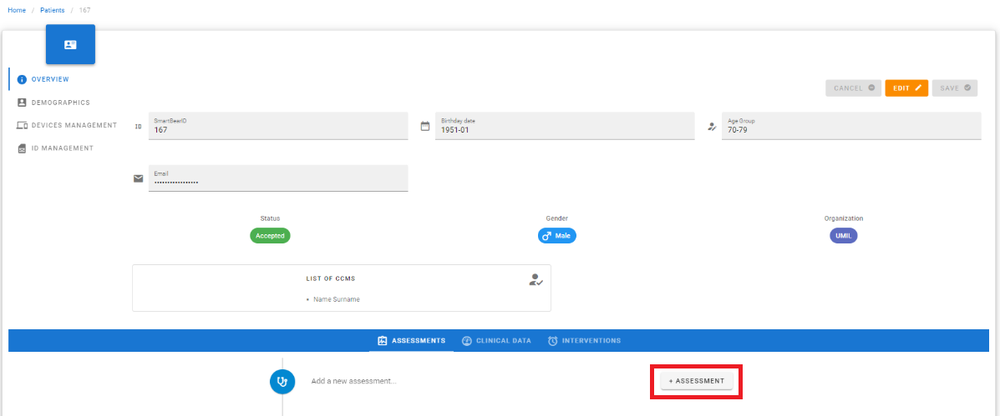
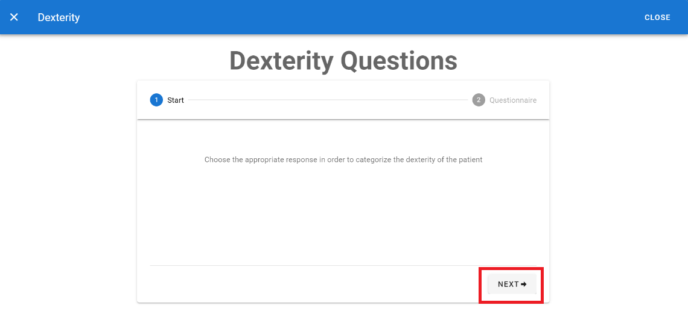
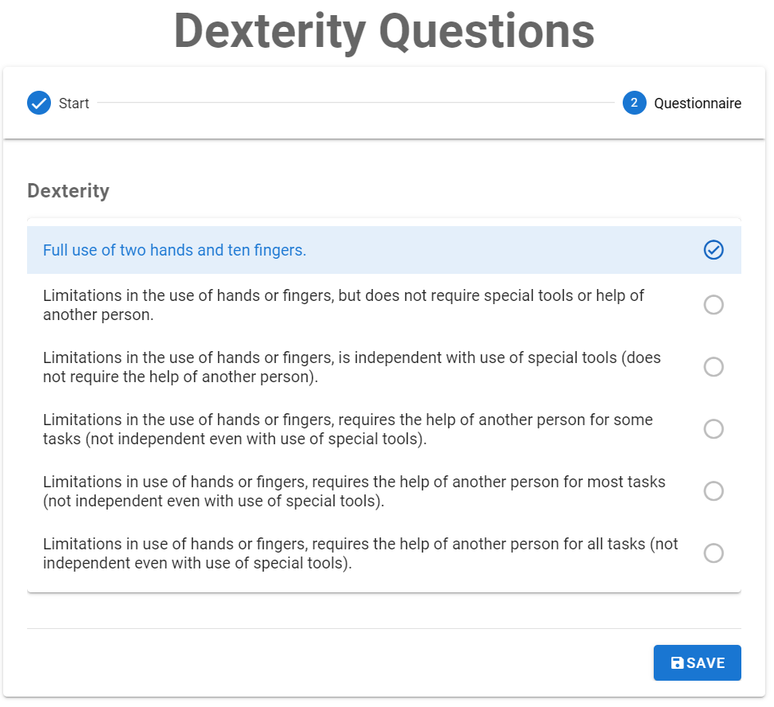
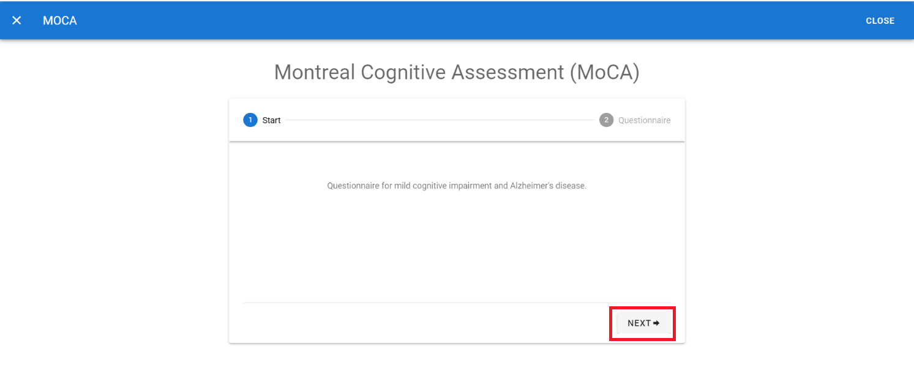
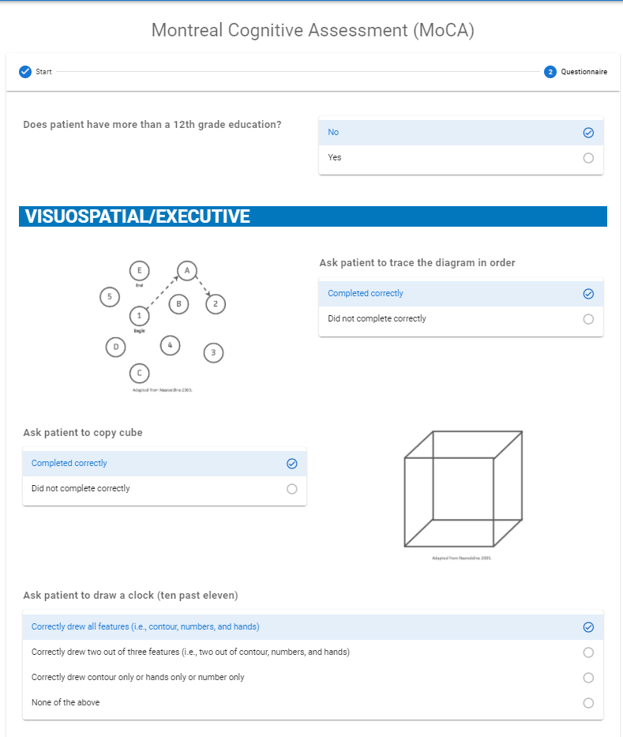
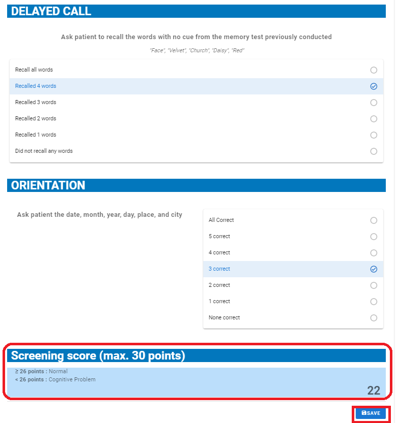
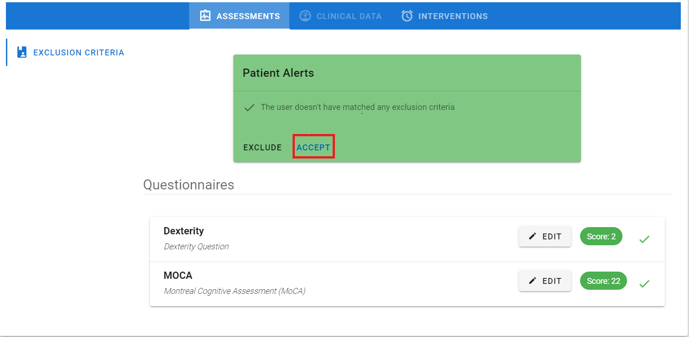
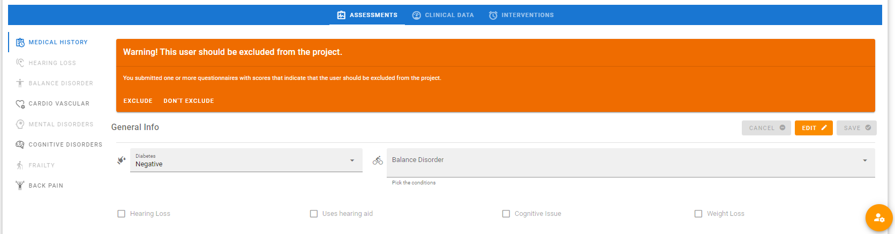
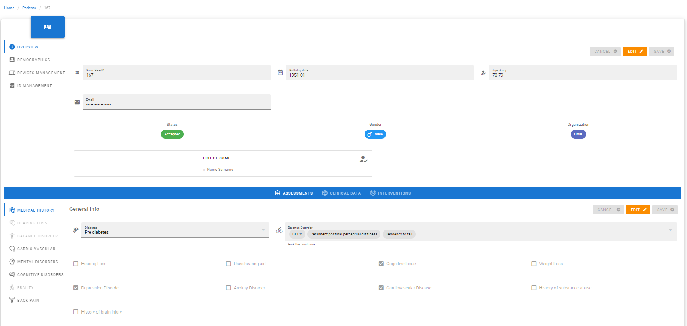

## Intro

In order to the include or exclude a patient from SMART BEAR, start the clinical assessment by administering the MoCA and the Dexterity (from the Health Utilities Index 3). The steps to begin the clinical assessment are the following:

1.	Click on +ASSESSMENT (see figure ) and a new Assessment is generated. 
2.	Click on SHOW (see Figure ) and the Exclusion Criteria tab appears (see Figure ), otherwise click on DELETE to cancel the Assessment.

<figure id="Pic_56" >

<figcaption style="text-align:center">Figure  </figcaption>
</figure>

<figure id="Pic_57" >

<figcaption style="text-align:center">Figure  </figcaption>
</figure>

### Dexterity

Follow the steps below to fill the Dexterity question:
1.	Click on +ADD (see figure ). The questionnaire description appears (see figure )
2.	Click on NEXT (see figure ) to open the questionnaire, where the question and the response options are provided (see Figure )
3.	Click on the responses given by the user then click on SAVE to complete the procedure and save the data.
After saving the response, the Dexterity score appears in the Assessment tab (see Figure ).

<figure id="Pic_59" >

<figcaption style="text-align:center">Figure  </figcaption>
</figure>

<figure id="Pic_60" >

<figcaption style="text-align:center">Figure 1. </figcaption>
</figure>

<figure id="Pic_60a" >

<figcaption style="text-align:center">Figure  </figcaption>
</figure>

### Montreal Cognitive Assessment (MoCA)

Follow the steps below to fill the MoCA questionnaire:

1.	Click on ADD button (see Figure )  to open questionnaire description (see Figure )
2.	Click on NEXT to open the questionnaire (see Figure ), to open the questionnaire, where the questions and the response options are provided 
3.	Click on the responses given by the user to each question. The score is calculated automatically at the bottom of the tab as it is shown in and the threshold value for diagnosing a Cognitive Disorder is reported (see Figure )
4.	Click on SAVE button (see Figure ). 

After saving the responses, the MoCA score appears in the Assessment tab (see Figure  ).

<figure id="Pic_61" >

<figcaption style="text-align:center">Figure  </figcaption>
</figure>

<figure id="Pic_63" >

<figcaption style="text-align:center">Figure </figcaption>
</figure>

<figure id="Pic_64" >

<figcaption style="text-align:center">Figure </figcaption>
</figure>

<figure id="Pic_65" >

<figcaption style="text-align:center">Figure </figcaption>
</figure>

### Acceptation

After completing the Dexterity and the MoCA, the following cases can happen:
1.	If the patient matches the exclusion criteria, a green popup appears (see Figure ), click on ACCEPT to accept the patient, otherwise click on CANCEL (see Figure ). If the patient is NOT accepted, all data related to him/her must be deleted according to GDPR. 
2.	If the patient does NOT match the exclusion criteria, an orange popup appears (see Figure ), which shows a warning message. In this case click on DON’T EXCLUDE to accept the patient anyway, otherwise click on EXCLUDE. If the patient is NOT accepted, all data related to him/her must be deleted according to GDPR.

An alternative mechanism to accept a patient is to go back to the Patients page and click on EDIT and change the patient’s status to ACTIVE (see Section ). 

<figure id="Pic_66" >

<figcaption style="text-align:center">Figure </figcaption>
</figure>

<figure id="Pic_67" >

<figcaption style="text-align:center">Figure </figcaption>
</figure>