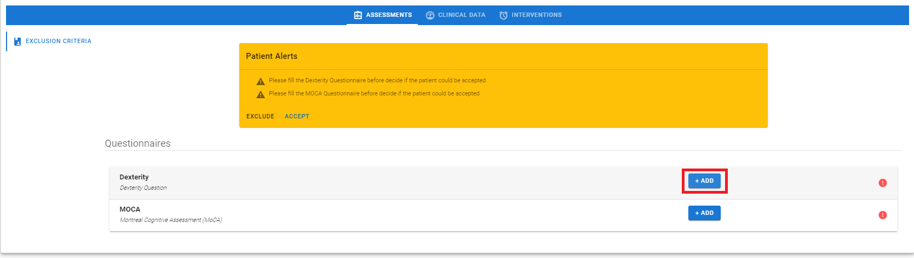

## General

After a patient is accepted click on the __+ASSESSMENT__ button  and a new Assessment is
generated.

<figure id="Pic_56" >

<figcaption style="text-align:center">Figure 1. </figcaption>
</figure>

Click on the __SHOW__ button and the Medical History tab appears, where data from the General
Assessment can be inserted, saved and modified. This tab is divided into the following tabs:

- __General Info__. It can be filled with data on comorbities
- __Life Habits__. It can be filled with data on Life Habits
- __Physical Examinations__. It can be filled with data from the physical examinations
- __Medications__. It can be used to create, save, edit and delete the medications
- __Diet supplements__. It can be used to create, save, edit and delete the diet supplements
- __Questionnaires__. It contains the questionnaires to be administered in the General Assessment, i.e in all
cases.

<figure id="Pic_57" >

<figcaption style="text-align:center">Figure  </figcaption>
</figure>

In order to assess the assess the exclusion criteria and deem a patient eligible, open the MoCA and the
Dexterity questionnaire in the Questionnaires tab, according to the steps in the following steps.

### Dexterity

Follow the steps below to fill the Dexterity question:

1. Click on the +ADD button. The questionnaire description appears

<figure id="Pic_58" >

<figcaption style="text-align:center">Figure  </figcaption>
</figure>

2. Click on the NEXT button. The questionnaire tab appears 

<figure id="Pic_59" >

<figcaption style="text-align:center">Figure 1. </figcaption>
</figure>

3. Click on the responses given by the user then click on the SAVE button to complete the procedure and
save the data .

<figure id="Pic_60" >

<figcaption style="text-align:center">Figure 1. </figcaption>
</figure>

After saving the response, the Dexterity score appears in the Assessment tab.

### Montreal Cognitive Assessment (MoCA)

Follow the steps below to fill the MoCA questionnaire:

1. Click on the +ADD button and the questionnaire description appears 

<figure id="Pic_61" >

<figcaption style="text-align:center">Figure  </figcaption>
</figure>

2. Click on the NEXT button to proceed. The questionnaire tab appears 

<figure id="Pic_62" >

<figcaption style="text-align:center">Figure </figcaption>
</figure>

3. Click on the responses given by the user to each question. The score is calculated automatically at the
bottom of the tab as it is shown in and the threshold value for diagnosing a Cognitive Disorder is reported

<figure id="Pic_63" >

<figcaption style="text-align:center">Figure </figcaption>
</figure>

4. Click on the SAVE button.

<figure id="Pic_64" >

<figcaption style="text-align:center">Figure </figcaption>
</figure>

After saving the responses, the MoCA score appears in the Assessment tab.

<figure id="Pic_65" >

<figcaption style="text-align:center">Figure </figcaption>
</figure>