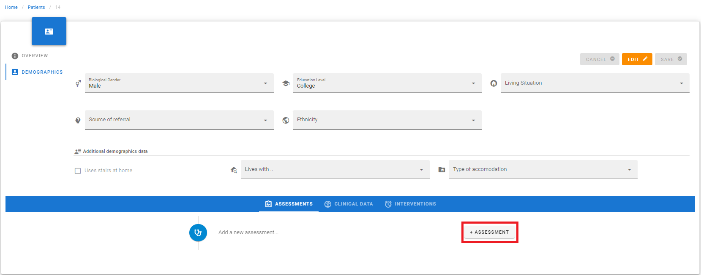
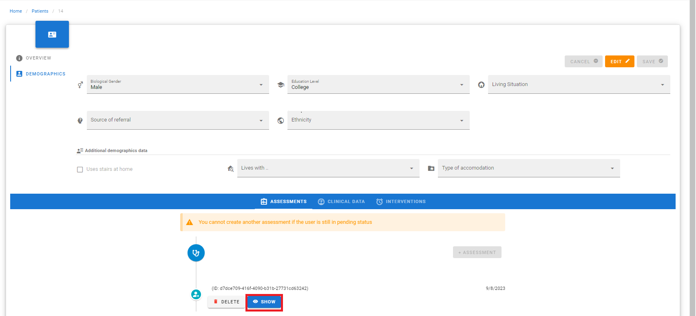
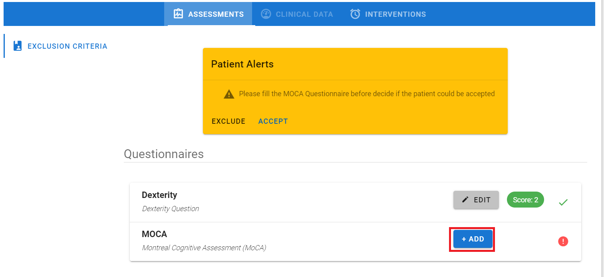

## Intro

In order to the include or exclude a patient from SMART BEAR, start the clinical assessment by administering the MoCA and the Dexterity (from the Health Utilities Index 3). The steps to begin the clinical assessment are the following:

1.	Click on +ASSESSMENT and a new Assessment is generated. 
2.	Click on SHOW and the Exclusion Criteria tab appears, otherwise click on DELETE to cancel the Assessment.

<figure id="Pic_1a" >

<figcaption style="text-align:center">Step 1</figcaption>
</figure>

<figure id="Pic_1" >

<figcaption style="text-align:center">Step 2.</figcaption>
</figure>

### Dexterity

Follow the steps below to fill the Dexterity question:
1.	Click on +ADD. The questionnaire description appears 
2.	Click on NEXT to open the questionnaire, where the question and the response options are visualized 
3.	Click on the responses, then click on SAVE to complete the procedure and save the data.
After saving the response, the Dexterity score appears in the Assessment tab.

<figure id="Pic_57" >

<figcaption style="text-align:center">Step 1 </figcaption>
</figure>

<figure id="Pic_59" >

<figcaption style="text-align:center"> Step 2 </figcaption>
</figure>

<figure id="Pic_60" >

<figcaption style="text-align:center"> Step 3 </figcaption>
</figure>

### Montreal Cognitive Assessment (MoCA)

Follow the steps below to fill the MoCA questionnaire:

1.	Click on ADD to open questionnaire description 
2.	Click on NEXT to open the questionnaire, to open the questionnaire, where the questions and the response options are provided 
3.	Click on the responses given by the user to each question. The score is calculated automatically at the bottom of the tab as it is shown in and the threshold value for diagnosing a Cognitive Disorder is reported 
4.	Click on SAVE.

**Note: the patient must obtain a score => 18 to be considered eligible. If the score is lower, the dashboard will generate a message for you to consider excluding the patient.**
**If the score is => 18 and <= 26, the patient is a candidate to be monitored for Cognitive Disorders**

After saving the responses, the MoCA score appears in the Assessment tab.

<figure id="Pic_60a" >

<figcaption style="text-align:center">Step 1</figcaption>
</figure>

<figure id="Pic_61" >

<figcaption style="text-align:center"> Step 2 </figcaption>
</figure>

<figure id="Pic_63" >

<figcaption style="text-align:center">Step 3</figcaption>
</figure>

<figure id="Pic_64" >

<figcaption style="text-align:center"> Step 4 </figcaption>
</figure>

### Acceptation

After completing the Dexterity and the MoCA, the following cases can happen:
1.	If the patient matches the exclusion criteria, a green popup appears, click on ACCEPT to accept the patient, otherwise click on CANCEL. If the patient is NOT accepted, all data related to him/her must be deleted according to GDPR. 
2.	If the patient does NOT match the exclusion criteria, an orange popup appears, which shows a warning message. In this case click on DON’T EXCLUDE to accept the patient anyway, otherwise click on EXCLUDE. If the patient is NOT accepted, all data related to him/her must be deleted according to GDPR.

An alternative mechanism to accept a patient is to go back to the Patients page and click on EDIT and change the patient’s status to ACTIVE. 

<figure id="Pic_66" >

<figcaption style="text-align:center"> Step 1 </figcaption>
</figure>

<figure id="Pic_67" >

<figcaption style="text-align:center"> Step 2</figcaption>
</figure>

The algorithm provided to assess the exclusion criteria is shown in the flowchart [here](https://github.com/Smartbear-Unimi/sb-ui-doc/blob/12-exclusion-criteria/content/en/docs/operating/exclusion-criteria/Flowchart.md).
