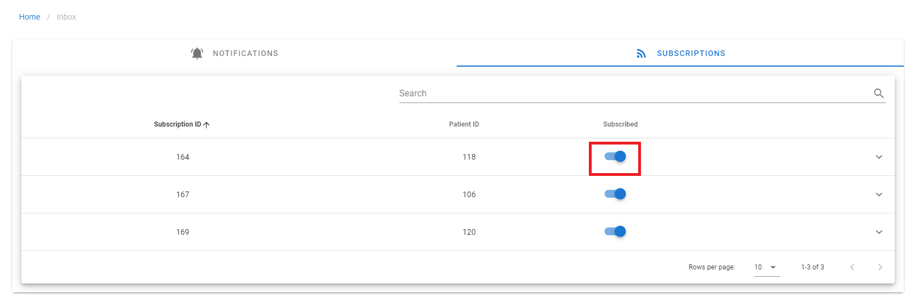

## Management of notifications and subscriptions

In order to manage the Notifications and Subscriptions, click on INBOX. In the subscription tab, click on the button under SUBSCRIBED to activate or deactivate the messages from a patient.

 <figure id="Pic_1" >

</figure>