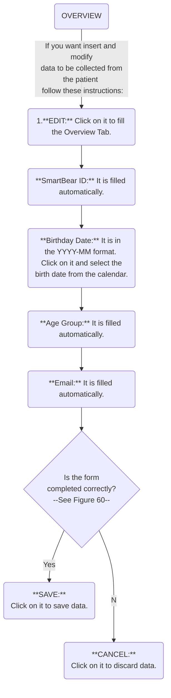

## Overview flowchart





## Demographics flowchart

```mermaid
graph TD;
	Start(DEMOGRAPHICS)--If you want insert and modify<br> data to be collected from the patient <br> follow these instructions:-->First(1. **DEMOGRAPHICS:** <br>Click on it to open Demographics tab.)
	First-->BGender(**Biological Gender:** Click on it and select <br> one of the several genders from the menu.)
    BGender-->EduLevel(**Education level:** Click on it and select <br> one education level from the menu.)
    EduLevel-->LivSituation(**Living situation:** Click on it and select one of the <br> description  of the patient's living place from the menu.)
    LivSituation-->SRef(**Source of referral:** Click on Source of Referral and select a person <br> or a medium, that referred the patient to SMART BEAR, from the menu.)
    SRef--Medium -- e.g. social media -->Et(**Ethnicity:** Click on it and select ethnic groups from the menu.)
    Et--Ethnicity required to perform some analytics-->AddDem(In **Additional demographics data:**)
	AddDem-->AtHome(If necessary, tick **Uses stairs at home**.)
	AddDem-->FamSit(**Family situation:** Click on it and select <br> **Lives Alone** or **Lives with family** from the menu.)
	FamSit-->TypeAcc(**Type of accomodation:** Click on it and select a value <br> about patient's living situation from the menu)
	TypeAcc-->IsCompleted{Is the form <br> completed correctly? <br> --See Figure 60--}

	IsCompleted--Yes-->Save(**SAVE:** <br>Click on it to save data.)
	IsCompleted--No-->Cancel(**CANCEL:** <br>Click on it to discard data.)
	IsCompleted
linkStyle default interpolate basis
```


