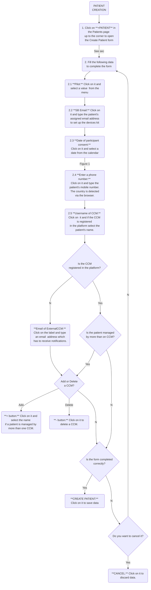

## Patient registration flowchart

```mermaid
graph TD;
    Start(PATIENT <br>CREATION)-->
    ClickPlusMed(1. Click on **+PATIENT** in the Patients page <br> up to the corner to open the Create Patient form);
    ClickPlusMed--See sec-->FillData(2. Fill the following data <br> to complete the form)
    FillData-->Pilot(2.1 **Pilot:** Click on it and <br> select a value  from the menu)
    Pilot-->SbEmail(2.2 **SB Email:** Click on it and type the patient's <br>  assigned email address  to set up the devices kit)
    SbEmail-->DateOf(2.3 **Date of participant consent:** <br> Click on it and select a date from the calendar)
    DateOf--Figure 1-->Phone(2.4 **Enter a phone number:** <br> Click on it and type the patient's mobile number. <br> The country is detected via the browser. )
    Phone-->UserCCM(2.5 **Username of CCM:** <br> Click on  it and if the CCM  is registered <br> in the platform select the patient's name.)
    UserCCM-->NotRegistered{Is the CCM <br> registered in the platform?}
    NotRegistered--No-->External(**Email of ExternalCCM:** Click on the label and type <br> an email  address which has to receive notifications.)
    NotRegistered--Yes-->MoreCCM{Is the patient managed <br> by more than on CCM?}
	
	
	MoreCCM--Yes-->IfAddDelete{Add or Delete <br> a CCM?}
    IfAddDelete--Add-->AddCCM(**+ button:** Click on it and select the name <br>if a patient is managed by more than one CCM.)
    IfAddDelete--Delete-->DelCCM(**- button:** Click on it to delete a CCM.)

	MoreCCM--No-->IsCompleted
    

	External-->IfAddDelete
	IfAddDelete--No-->IsCompleted{Is the form completed <br> correctly?}

	IsCompleted--Yes-->Create(**CREATE PATIENT:** Click on it to save data)
	IsCompleted--No-->ToCancel{Do you want to cancel it?}
	
	ToCancel--Yes-->Cancel(**CANCEL:** Click on it to discard data.)
	ToCancel--No-->FillData

linkStyle default interpolate basis
```

