## Patient creation

Click on +PATIENT (see Figure ) in the Patients page at the upper right corner (see sec. ) to open the Create patient form (see ).

Fill these data to complete the form:

•	Click on Pilot, (e.g. “Testing”, see Figure ) then select a value from the menu (see Figure ). The Organization field is filled automatically 
•	Click on SB Email (see Figure ) and type the email address that has been assigned to the patient to set up the devices kit (see Figure )
•	Click on Date of participant consent (see Figure 45) and select a date from the calendar (see Figure )
•	Click on Enter a phone number (see Figure ) and type the patient’s mobile number (see Figure ). The country is detected via the browser
•	Click on Username of CCM  (see Figure ) if the CCM is registered in the platform select his/her name from the menu (see Figure ). If a patient is managed by more than one CCM, click on the + button and select the name if available (see Figure ). To delete a CCM, click on the – button 
•	If the CCM is not registered in the platform, click on External CCM, click on the label Email of External CCM (see Figure 53) and type the email address of the External CCM has to receive the notifications (see Figure 54). If a patient is managed by more than one CCM, click on the + button and type the email address. To delete an External CCM, click on the - button.

If you have completed the form correctly click on CREATE PATIENT to save the data, otherwise, click on CANCEL to discard them (see Figure 55).

After the patient is created, the patient’s record is generated, which includes the Overview (see section 4.3.2) and Demographics tabs (see section 4.3.3).

<figure id="Pic_32" >
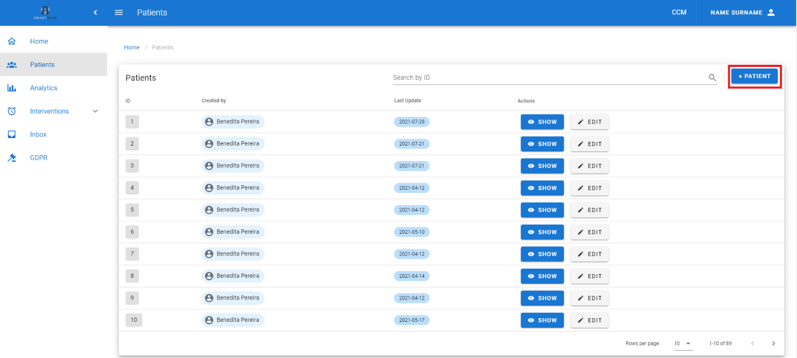
<figcaption style="text-align:center">Figure 1. </figcaption>
</figure>

<figure id="Pic_33" class="centered-figure">
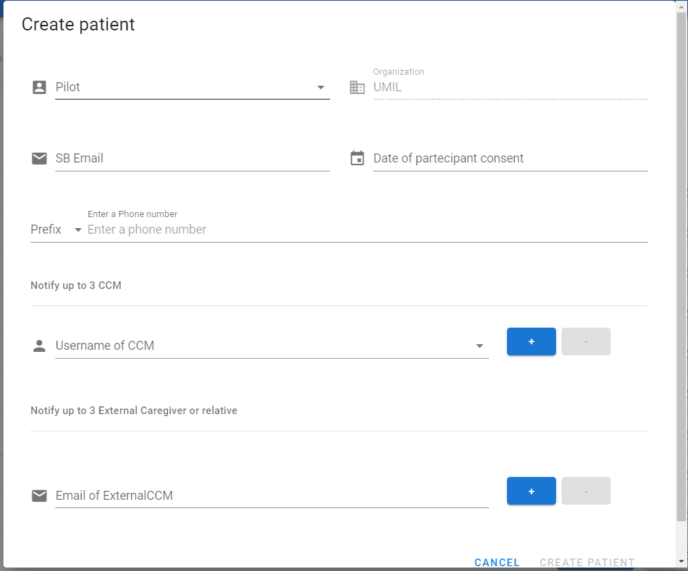
<figcaption style="text-align:center">Figure 2. </figcaption>
</figure>

<figure id="Pic_34" >
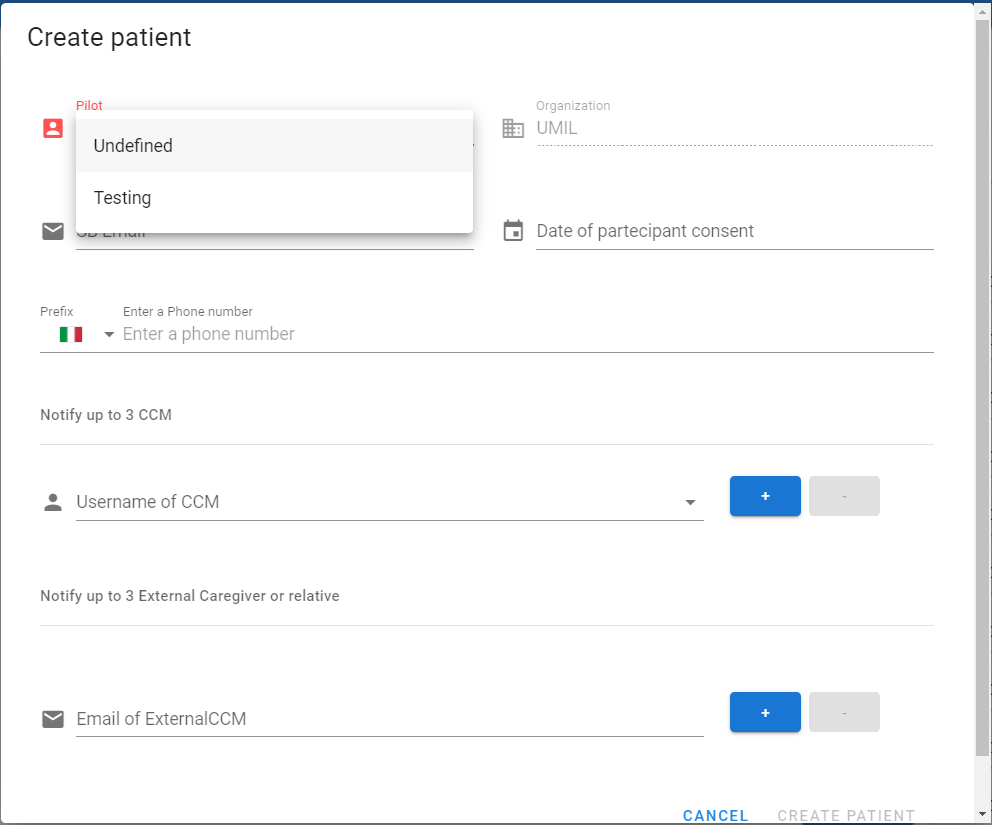
<figcaption style="text-align:center">Figure 3. </figcaption>
</figure>

<figure id="Pic_35" >
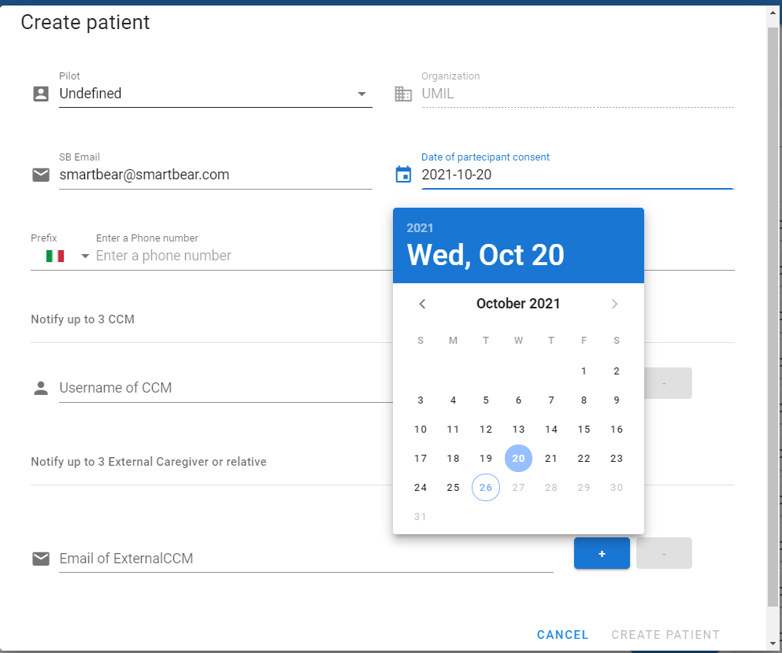
<figcaption style="text-align:center">Figure 4. </figcaption>
</figure>

<figure id="Pic_36" >
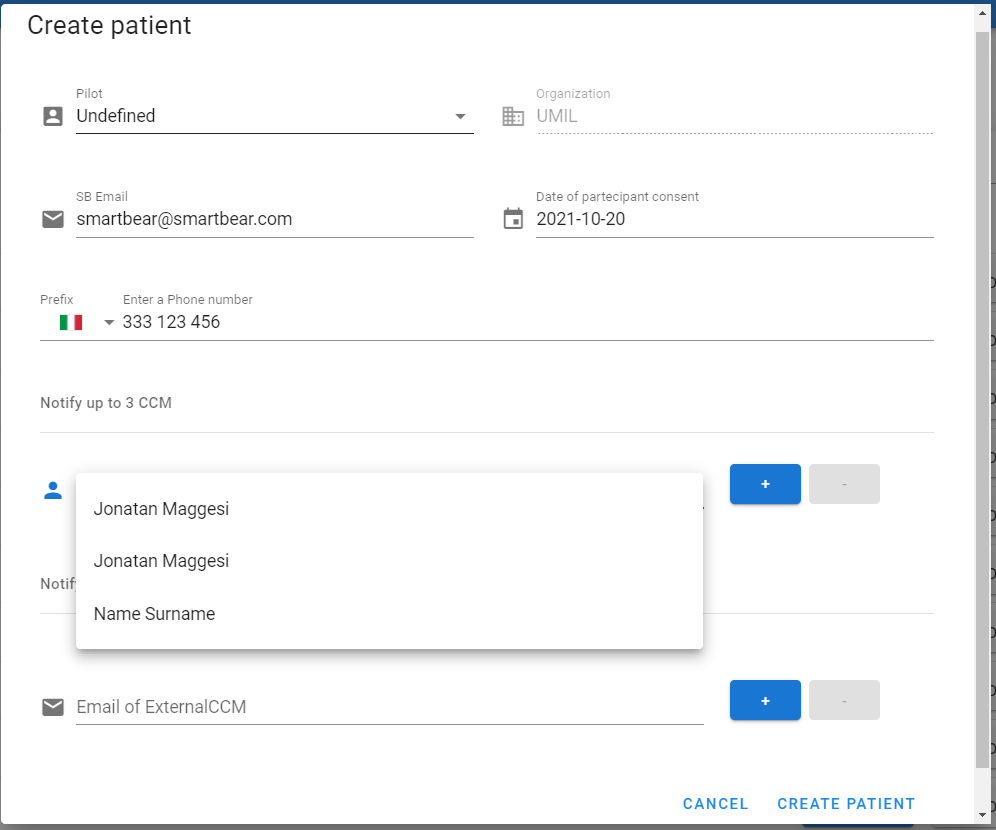
<figcaption style="text-align:center">Figure 5. </figcaption>
</figure>

<figure id="Pic_37" >
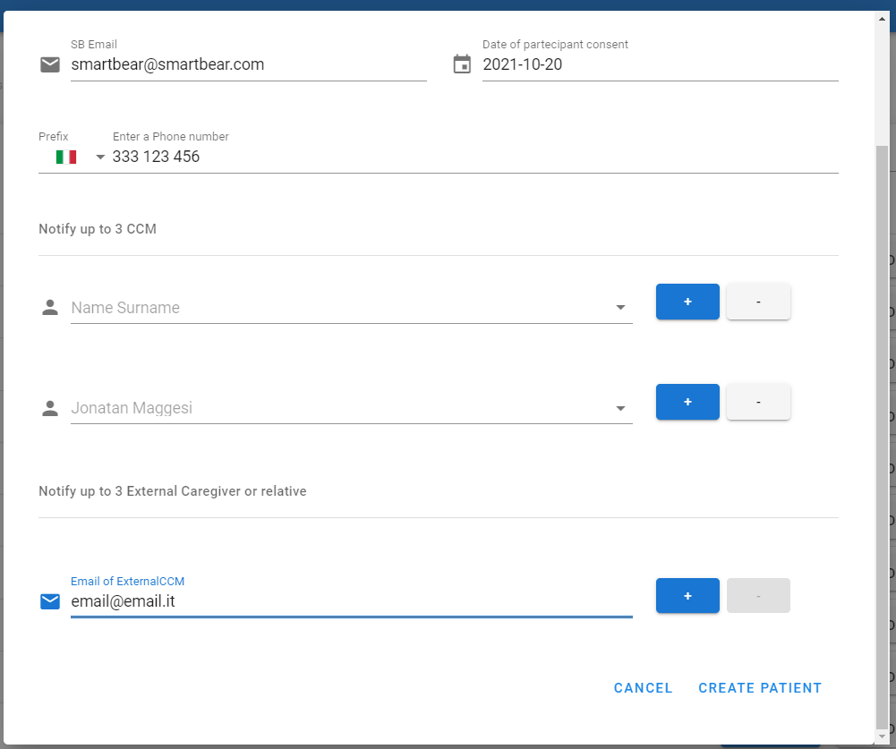
<figcaption style="text-align:center">Figure 6. </figcaption>
</figure>

<figure id="Pic_38" class="centered-figure">
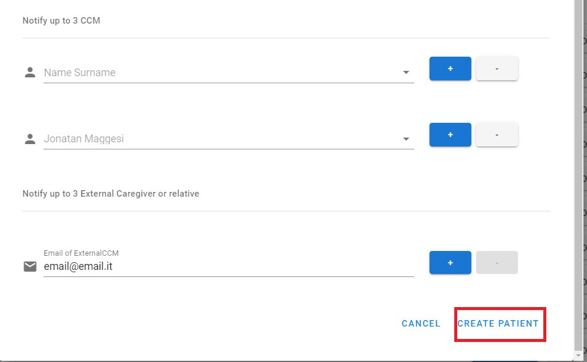
<figcaption style="text-align:center">Figure 7. </figcaption>
</figure>

</figure>

## Overview {#overview}

The Overview tab is shown in Figure 56. It allows the user to insert and modify the following data to be collected from the patient:

•	SmartBear ID. It contains the patient’s ID and is filled automatically.
•	Birthday Date. It is in the YYYY-MM format. Click on the Birthday Date (see Figure 58) and select the date from the calendar (see Figure 59)
•	Age Group. It is filled automatically
•	Email. It is filled automatically.

To fill the Overview tab, click on EDIT (see Figure 57). If you have completed the form correctly click on SAVE to save the data, otherwise click on CANCEL to discard them (see Figure 60).

<figure id="Pic_40" >
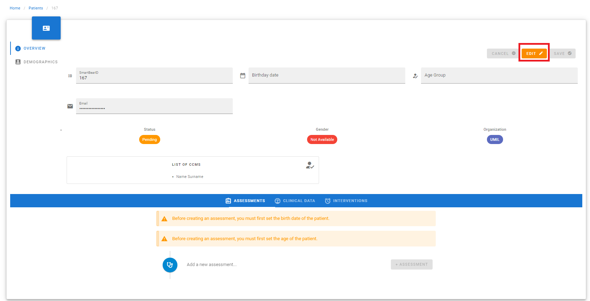
<figcaption style="text-align:center">Figure 8.</figcaption>
</figure>

<figure id="Pic_41" >
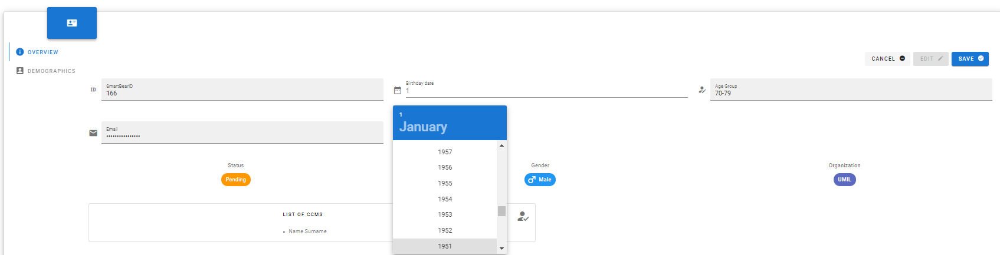
<figcaption style="text-align:center">Figure 9. </figcaption>
</figure>

<figure id="Pic_42" >
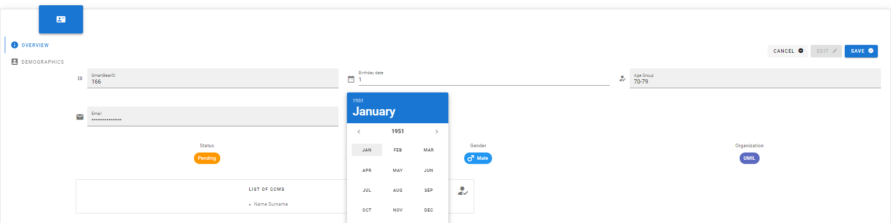
<figcaption style="text-align:center">Figure 10. </figcaption>
</figure>

<figure id="Pic_43" >
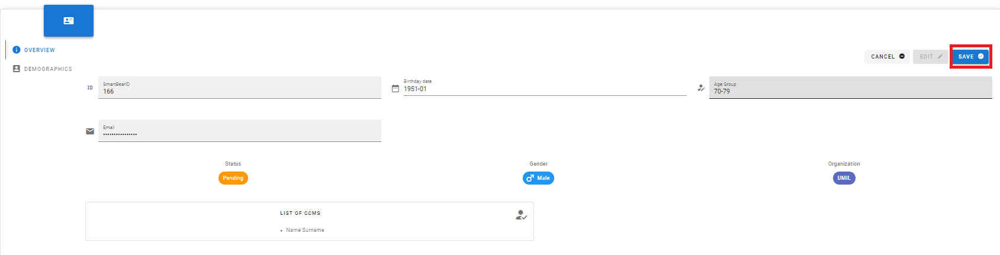
<figcaption style="text-align:center">Figure 11. </figcaption>
</figure>

## Demographics

Click on the DEMOGRAPHICS (see Figure 61) to open the Demographics tab (see Figure 62) where the user is allowed to insert and modify the following data to be collected from the patient:

•	Biological Gender. It can be either a binary non-binary gender. The patient can also choose to NOT disclose this information. Click on Biological Gender (see Figure 63) and select a value from the menu (see Figure 64).
•	Education level. Click on Education Level (see Figure 65) and select a value from the menu (see Figure 66)
•	Living situation. It provides a description of the patient’s living place (e.g. an apartment with access to an elevator). Click on Living Situation (see Figure 67) and select a value from the menu (see Figure 68)
•	Source of referral. It is the person or medium (e.g. social media) that referred the patient to SMART BEAR. Click on Source of Referral (see Figure 69) and select a value from the menu (see Figure 70)
•	Ethnicity. This information is required to perform some analytics, and refers to large ethnic groups (e.g. caucasian, african). Click on Ethnicity (see Figure 71)  and select a value from the menu (see Figure 72)
•	If necessary, tick Uses stairs at home (see Figure 73)
•	Family situation. This information refers to the presence of a family. Click on Lives with and select a value from the menu (see Figure 75)
•	Type of accommodation. This information consists of further details with regards to the living situations. Click on Type of Accommodation (see Figure 75) and select a value from the menu (see Figure 76).

To fill the tab, click on EDIT.  If you have completed the tab correctly, click on the SAVE button to save the data, otherwise click on the CANCEL button to discard them.

<figure id="Pic_44" >
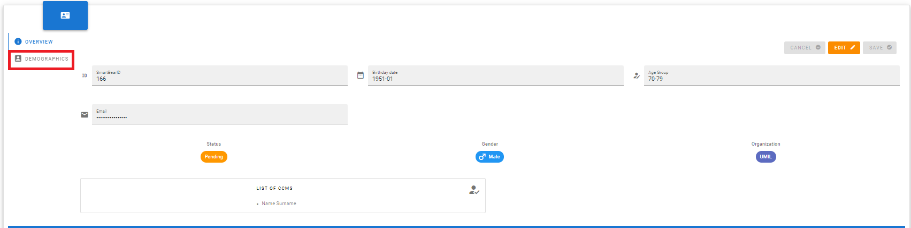
<figcaption style="text-align:center">Figure 12.</figcaption>
</figure>

<figure id="Pic_45" >
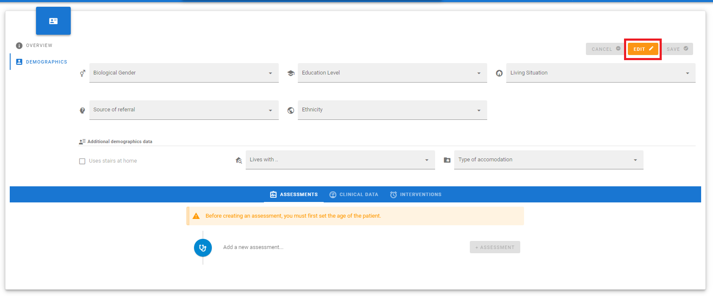
<figcaption style="text-align:center">Figure 13.</figcaption>
</figure>

<figure id="Pic_46" >
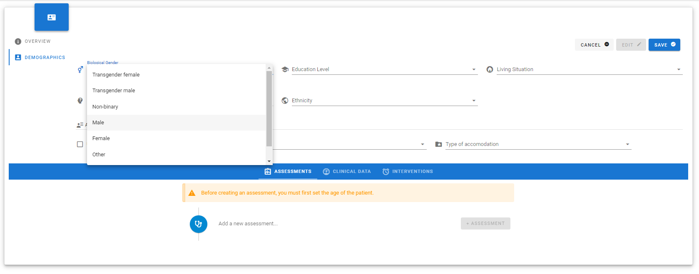
<figcaption style="text-align:center">Figure 14.</figcaption>
</figure>

<figure id="Pic_47" >
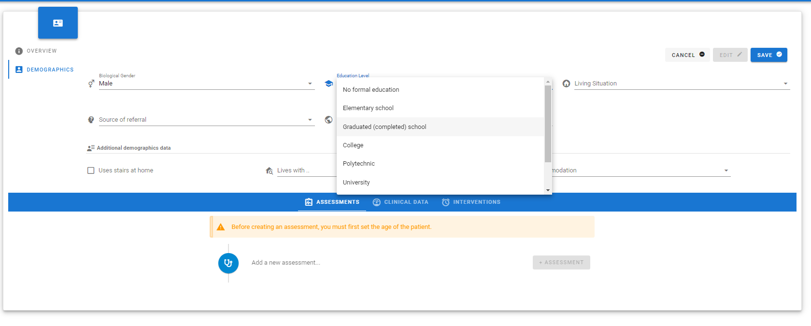
<figcaption style="text-align:center">Figure 15.</figcaption>
</figure>

<figure id="Pic_48" >
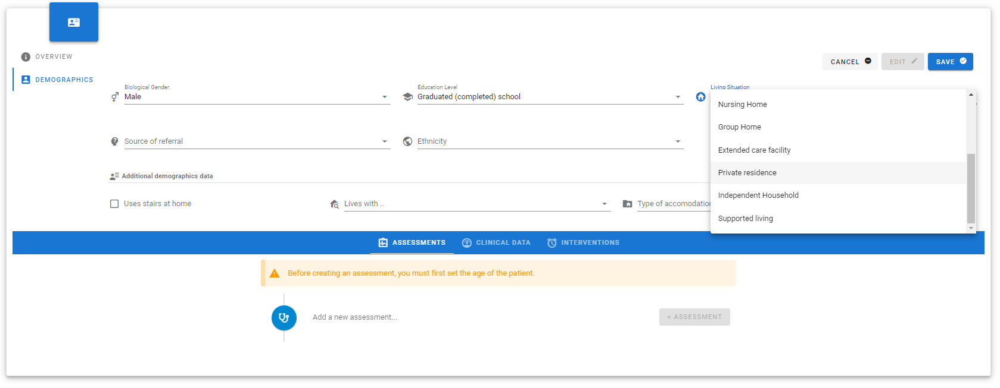
<figcaption style="text-align:center">Figure 16.</figcaption>
</figure>

<figure id="Pic_49 >
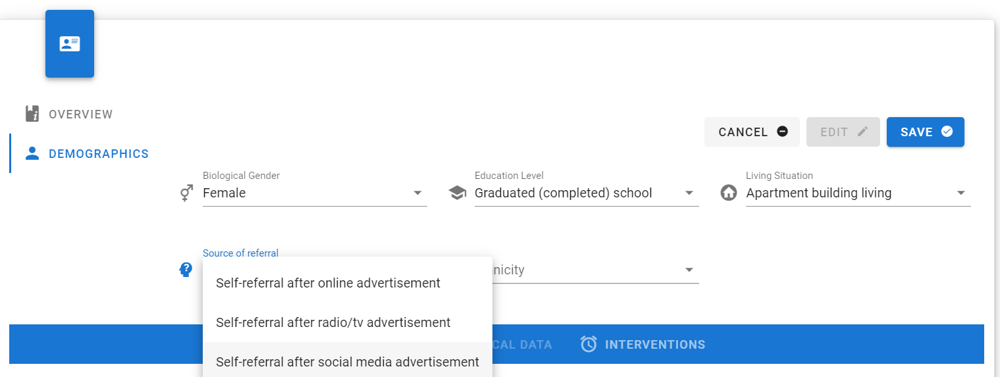
<figcaption style="text-align:center">Figure 17.</figcaption>
</figure>

<figure id="Pic_50" >
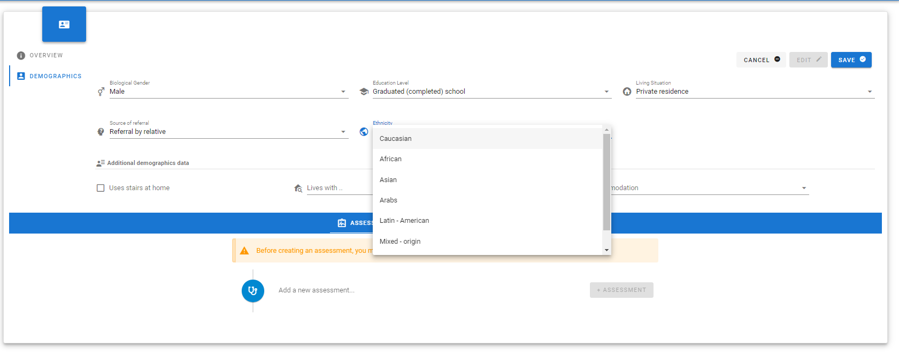
<figcaption style="text-align:center">Figure 18.</figcaption>
</figure>

<figure id="Pic_51" >
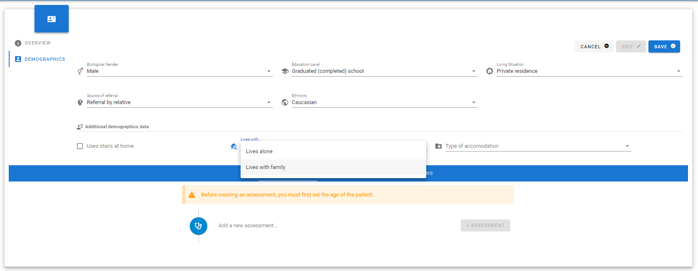
<figcaption style="text-align:center">Figure 19.</figcaption>
</figure>

<figure id="Pic_52" >
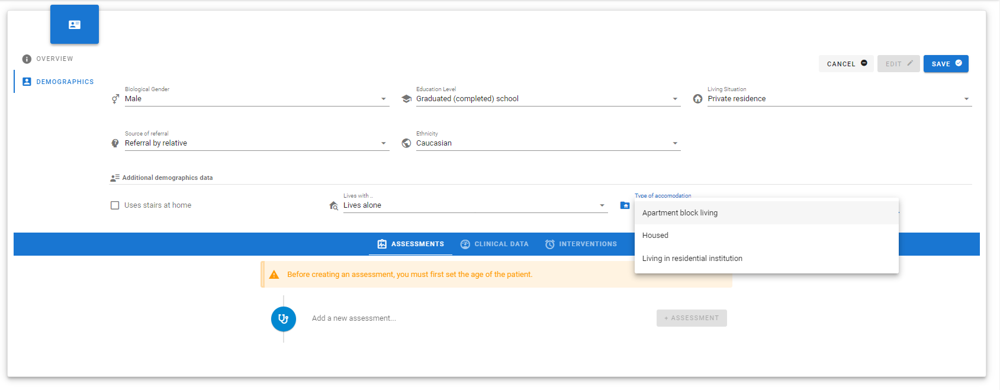
<figcaption style="text-align:center">Figure 20.</figcaption>
</figure>

<figure id="Pic_53" >
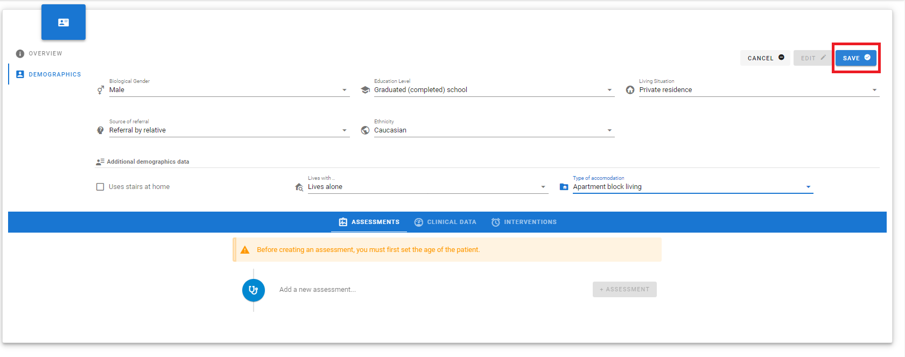
<figcaption style="text-align:center">Figure 21.</figcaption>
</figure>

