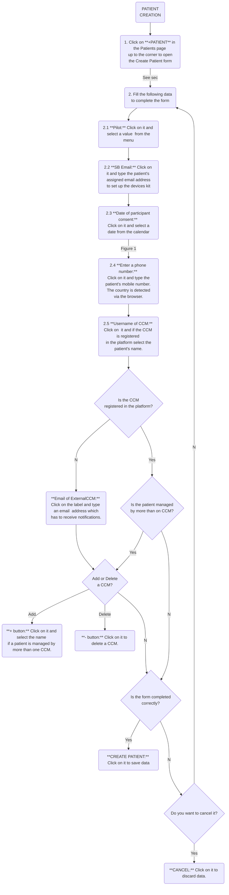
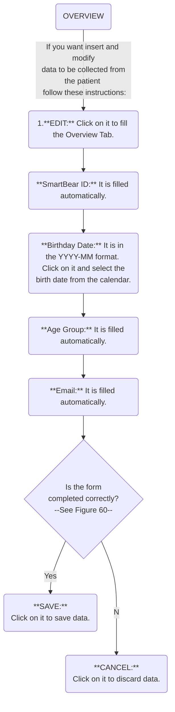

## Patient creation




After the patient is created, the patient’s record is generated, which includes the Overview (see section 4.3.2) and Demographics tabs (see section 4.3.3).

<figure id="Pic_32" >

<figcaption style="text-align:center">Figure 1. </figcaption>
</figure>

<figure id="Pic_33" class="centered-figure">

<figcaption style="text-align:center">Figure 2. </figcaption>
</figure>


<figure id="Pic_34" >

<figcaption style="text-align:center">Figure 3. </figcaption>
</figure>


<figure id="Pic_35" >

<figcaption style="text-align:center">Figure 4. </figcaption>
</figure>


<figure id="Pic_36" >

<figcaption style="text-align:center">Figure 5. </figcaption>
</figure>


<figure id="Pic_37" >

<figcaption style="text-align:center">Figure 6. </figcaption>
</figure>


<figure id="Pic_38" class="centered-figure">

<figcaption style="text-align:center">Figure 7. </figcaption>
</figure>


</figure>

## Overview {#overview}




<figure id="Pic_40" >

<figcaption style="text-align:center">Figure 8.</figcaption>
</figure>


<figure id="Pic_41" >

<figcaption style="text-align:center">Figure 9. </figcaption>
</figure>

<figure id="Pic_42" >

<figcaption style="text-align:center">Figure 10. </figcaption>
</figure>


<figure id="Pic_43" >

<figcaption style="text-align:center">Figure 11. </figcaption>
</figure>


## Demographics

```mermaid
graph TD;
	Start(DEMOGRAPHICS)--If you want insert and modify<br> data to be collected from the patient <br> follow these instructions:-->First(1. **DEMOGRAPHICS:** <br>Click on it to open Demographics tab.)
	First-->BGender(**Biological Gender:** Click on it and select <br> one of the several genders from the menu.)
    BGender-->EduLevel(**Education level:** Click on it and select <br> one education level from the menu.)
    EduLevel-->LivSituation(**Living situation:** Click on it and select one of the <br> description  of the patient's living place from the menu.)
    LivSituation-->SRef(**Source of referral:** Click on Source of Referral and select a person <br> or a medium, that referred the patient to SMART BEAR, from the menu.)
    SRef--Medium -- e.g. social media -->Et(**Ethnicity:** Click on it and select ethnic groups from the menu.)
    Et--Ethnicity required to perform some analytics-->AddDem(In **Additional demographics data:**)
	AddDem-->AtHome(If necessary, tick **Uses stairs at home**.)
	AddDem-->FamSit(**Family situation:** Click on it and select <br> **Lives Alone** or **Lives with family** from the menu.)
	FamSit-->TypeAcc(**Type of accomodation:** Click on it and select a value <br> about patient's living situation from the menu)
	TypeAcc-->IsCompleted{Is the form <br> completed correctly? <br> --See Figure 60--}

	IsCompleted--Yes-->Save(**SAVE:** <br>Click on it to save data.)
	IsCompleted--No-->Cancel(**CANCEL:** <br>Click on it to discard data.)
	IsCompleted
linkStyle default interpolate basis
```


<figure id="Pic_44" >

<figcaption style="text-align:center">Figure 12.</figcaption>
</figure>


<figure id="Pic_45" >

<figcaption style="text-align:center">Figure 13.</figcaption>
</figure>


<figure id="Pic_46" >

<figcaption style="text-align:center">Figure 14.</figcaption>
</figure>


<figure id="Pic_47" >

<figcaption style="text-align:center">Figure 15.</figcaption>
</figure>


<figure id="Pic_48" >

<figcaption style="text-align:center">Figure 16.</figcaption>
</figure>


<figure id="Pic_49 >

<figcaption style="text-align:center">Figure 17.</figcaption>
</figure>


<figure id="Pic_50" >

<figcaption style="text-align:center">Figure 18.</figcaption>
</figure>


<figure id="Pic_51" >

<figcaption style="text-align:center">Figure 19.</figcaption>
</figure>


<figure id="Pic_52" >

<figcaption style="text-align:center">Figure 20.</figcaption>
</figure>


<figure id="Pic_53" >

<figcaption style="text-align:center">Figure 21.</figcaption>
</figure>


