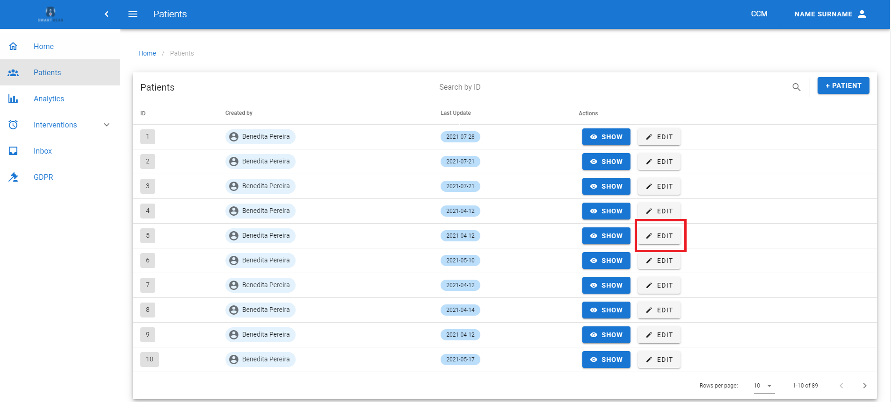
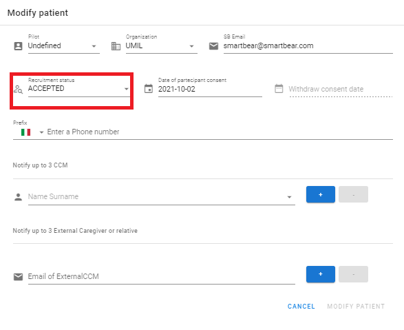

## Patient creation

Click on the __+PATIENT__ button in the Patients page at the upper right corner  and the _Create patient_ form appears .

<figure id="Pic_32" >

<figcaption style="text-align:center">Figure 1. </figcaption>
</figure>

<figure id="Pic_33" class="centered-figure">

<figcaption style="text-align:center">Figure 2. </figcaption>
</figure>

Follow these steps to create the record of a patient:

1. Click on the _Pilot_ label. A dropdown menu appears from which the user must select a value. The Organization field is filled automatically with the Institution the user belongs to.

<figure id="Pic_34" >

<figcaption style="text-align:center">Figure 3. </figcaption>
</figure>

2. Click on the _SB Email_ label and type the email address that has been created and assigned to the patient for the Recruitment in the _SB Email_ field.
3. Click on the label _Date of participant consent_. A calendar appears where the user must select a date.

<figure id="Pic_35" >

<figcaption style="text-align:center">Figure 4. </figcaption>
</figure>

4. Click on the label _Enter a phone number_ and type the patient’s mobile . The country is detected via the browser
5. Click on the label _Username of CCM_. A dropdown menu appears, select a value.

<figure id="Pic_36" >

<figcaption style="text-align:center">Figure 5. </figcaption>
</figure>

6. If necessary, click on the __+__ button and a new label appears. Fill as described at point 5. To delete a CCM, click on the __–__ button 

7. If the patient has an External CCM, click on the label _Email of External CCM_ and type the email address where the External CCM has to receive the notifications. To
delete an External CCM, click on the __-__ button.

<figure id="Pic_37" >

<figcaption style="text-align:center">Figure 6. </figcaption>
</figure>

8. Click on the _CREATE PATIENT_ button to save the data. Otherwise, click on the _CANCEL_ button to discard them. The [Overview]( "overview") tab appears.

<figure id="Pic_38" class="centered-figure">

<figcaption style="text-align:center">Figure 7. </figcaption>
</figure>

</figure>

## Overview {#overview}

The Overview tab allows the user to insert and modify data from the patient, more in detail the following fields are featured:

- __SmartBear ID__. It contains the patient’s ID, that is assigned automatically to a patient and is unique
and immutable
- __Birthday Date__. It contains the patient’s month and year of birth
- __Age Group__. It is assigned automatically based on the Birthday date
- __Email__. The patient's email is reported here (obfuscated).

Follow the steps below in order to insert or modify data in the Overview tab:

1. Click on the __EDIT__ button 

<figure id="Pic_40" >

<figcaption style="text-align:center">Figure 8.</figcaption>
</figure>

2. Click on the __Birthday Date__ field and click on the patient’s year and month of birth

<figure id="Pic_41" >

<figcaption style="text-align:center">Figure 9. </figcaption>
</figure>

<figure id="Pic_42" >

<figcaption style="text-align:center">Figure 10. </figcaption>
</figure>

3. Click on the __SAVE__ button to save the data, otherwise click on the __CANCEL__ button to discard

<figure id="Pic_43" >

<figcaption style="text-align:center">Figure 11. </figcaption>
</figure>

## Demographics

Click on the DEMOGRAPHICS button  The __Demographics__ tab appears where you can insert and modify data to be collected from the patients, more in detail the following fields are featured:

- __Biological Gender__. It contains the patient’s biological gender, either binary or non-binary
- __Education level__. It contains the higher education level pursued by the patients (e.g. Elementary
School)
- __Living situation__. It contains a description of the patient’s living place (e.g. Lives in apartment with
elevator access)
- __Source of referral__. It contains the source from which the patient came in contact with SMARTBEAR
for the first time
- __Ethnicity__. It contains the the patient’s ethnicity (e.g. Caucasian)
- __Lives with__. Alone or with family
- __Type of accommodation__.

<figure id="Pic_44" >

<figcaption style="text-align:center">Figure 12.</figcaption>
</figure>

Follow the steps below in order to insert or modify data in the tab:

1. Click on the EDIT button

<figure id="Pic_45" >

<figcaption style="text-align:center">Figure 13.</figcaption>
</figure>

2. Click on Biological Gender and a dropdown menu appears. Select a value

<figure id="Pic_46" >

<figcaption style="text-align:center">Figure 14.</figcaption>
</figure>

3. Click on Education Level and a dropdown menu appears. Select a value

<figure id="Pic_47" >

<figcaption style="text-align:center">Figure 15.</figcaption>
</figure>

4. Click on Living Situation and a dropdown menu appears. Select a value

<figure id="Pic_48" >

<figcaption style="text-align:center">Figure 16.</figcaption>
</figure>

5. Click on Source of Referral and a dropdown menu appears. Select a value

<figure id="Pic_49 >

<figcaption style="text-align:center">Figure 17.</figcaption>
</figure>

6. Click on Ethnicity and a dropdown menu appears. Select a value. If necessary, tick "Uses stairs at home".

<figure id="Pic_50" >

<figcaption style="text-align:center">Figure 18.</figcaption>
</figure>

8. Click on the field "Lives with..." and a dropdown menu appears. Select a value

<figure id="Pic_51" >

<figcaption style="text-align:center">Figure 19.</figcaption>
</figure>

9. Click on Type of Accommodation and a dropdown menu appears. Select a value

<figure id="Pic_52" >

<figcaption style="text-align:center">Figure 20.</figcaption>
</figure>

10. Click on the SAVE button to save the data, otherwise click on the CANCEL button to discard them 

<figure id="Pic_53" >

<figcaption style="text-align:center">Figure 21.</figcaption>
</figure>

## Patient Acceptation

After the Demographics page is complete, go back to the Patients page and click on the MODIFY button and
change the patient’s status to ACTIVE. 

<figure id="Pic_54" >

<figcaption style="text-align:center">Figure 22.</figcaption>
</figure>

<figure id="Pic_55" >

<figcaption style="text-align:center">Figure 23.</figcaption>
</figure>

After you complete these steps, two new buttons will appear in the patient’s record:

- __DEVICES MANAGEMENT__. Click on it and the Devices Management tab appears (see [Patient management]( "Patient management"))
- __ID MANAGEMENT__. Click on it and the ID Management tab appears (see [Patient management]( "Patient management"))

