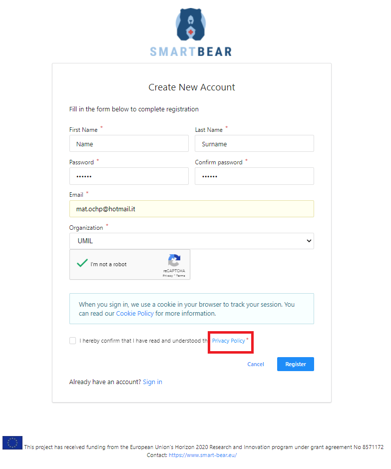
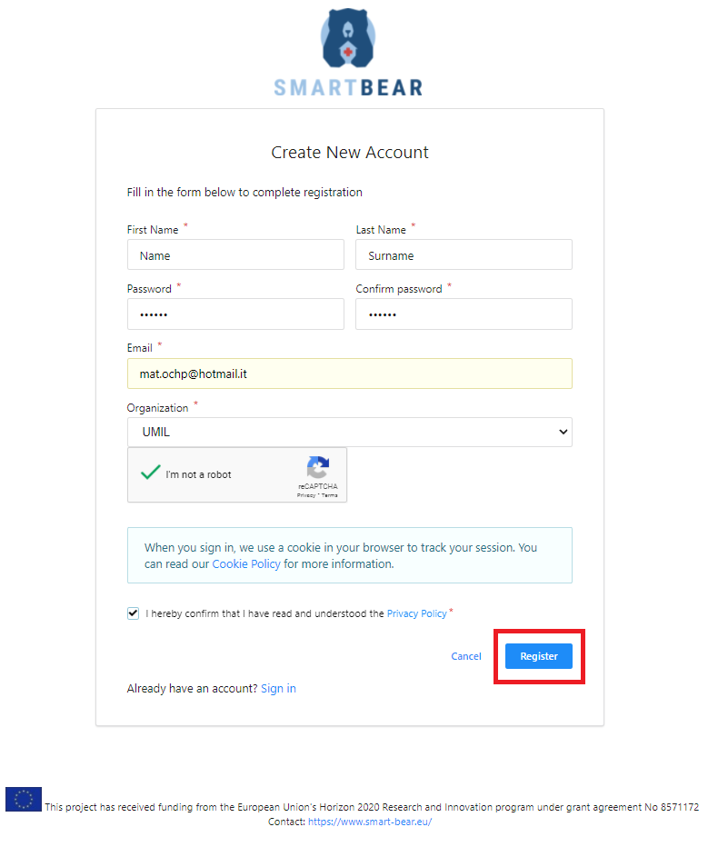

## Utilization

Click on the Create Account button in the Login form.

<figure id="Pic_25" class="centered-figure">

<figcaption style="text-align:center"> The Login form </figcaption>
</figure>

Type a username for registration in the field under Enter your username, then click on Proceed to Self Register.

<figure id="Pic_26" class="centered-figure">

<figcaption style="text-align:center"> </figcaption>
</figure>

<figure id="Pic_27" class="centered-figure">

<figcaption style="text-align:center"> </figcaption>
</figure>

To require access plese insert the following details under the respective fields in the registration form:

- First name under First Name
- Last name under Last Name
- Email under Email. No specific email service provider is required
- A password under Password and Password Confirmation
- Click on the Organization label and choose the represented organization in the dropdown menu that appears.

<figure id="Pic_29" class="centered-figure">

<figcaption style="text-align:center"></figcaption>
</figure>

After inserting the requested information click on the reCAPTCHA button then click on Privacy Policy and tick the checkbox. After completing the previous step click on Register.

<figure id="image032" class="centered-figure">

<figcaption style="text-align:center"></figcaption>
</figure>

<figure id="image034" class="centered-figure">

<figcaption style="text-align:center"></figcaption>
</figure>

After the administrator receives the registration request, login to your mailbox: check you have received a message from the administrator with the link, then click on the link to complete the registration.
