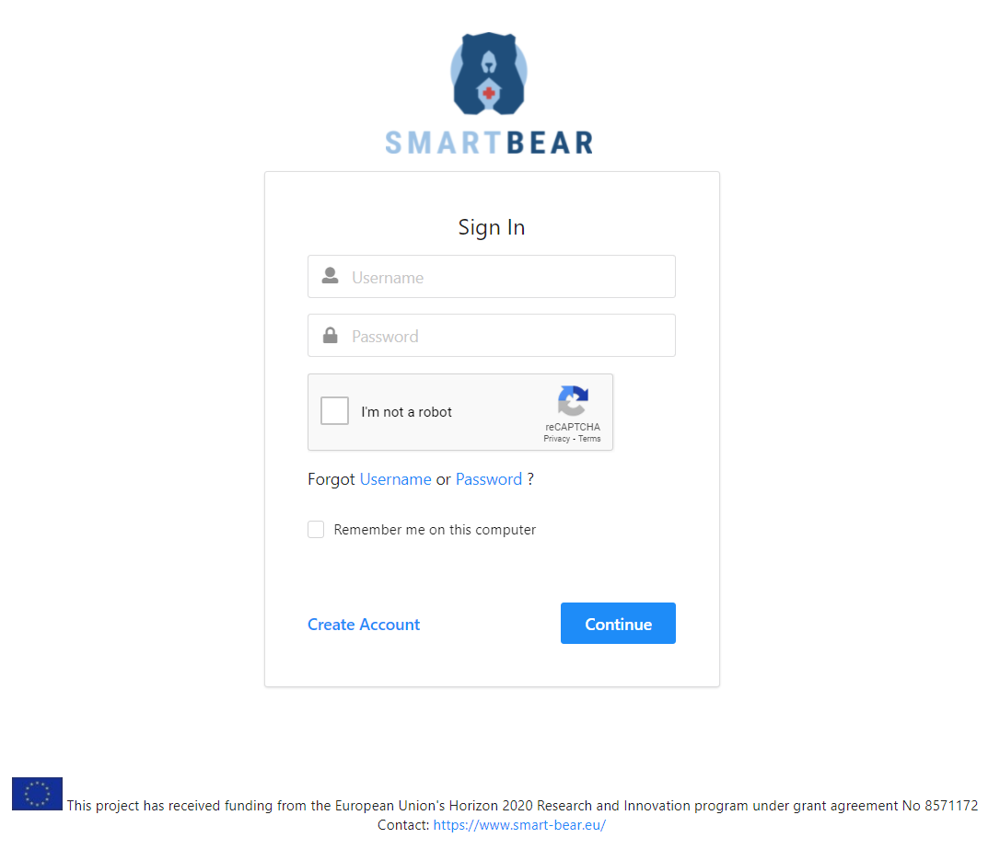
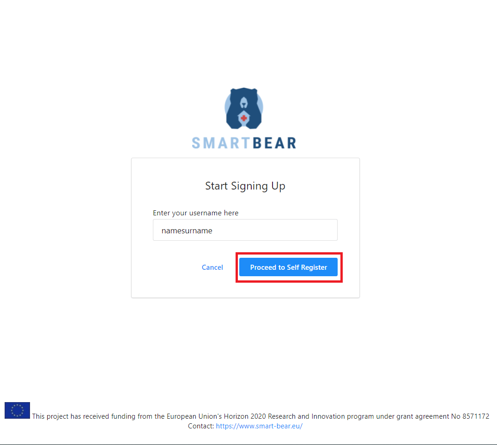
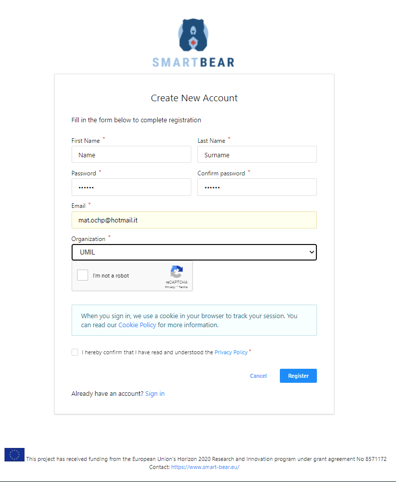
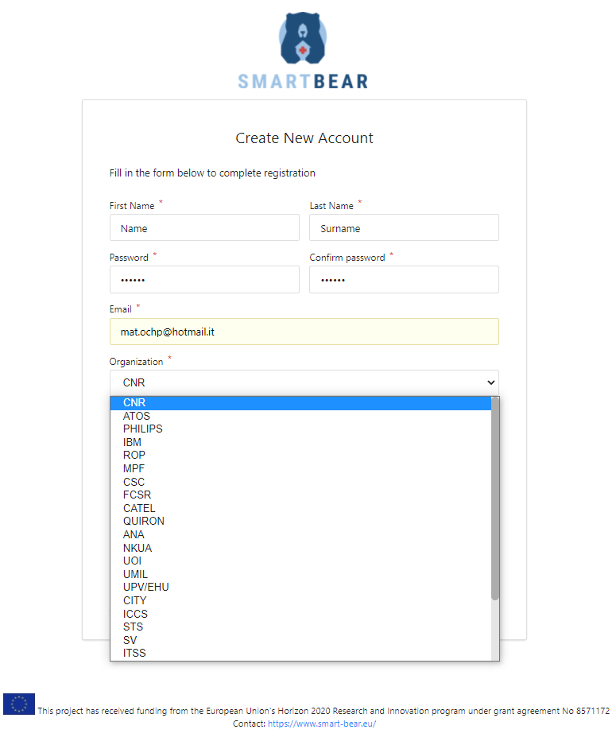
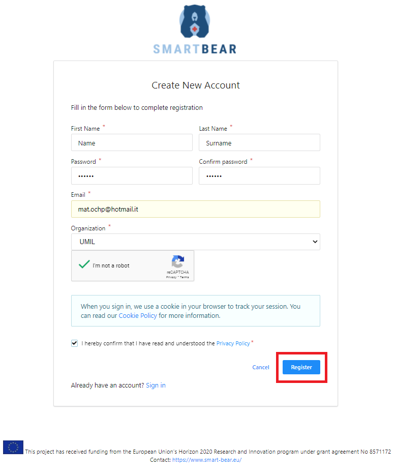

## Utilization

Click on the Create Account button in the Login form.

<figure id="Pic_25" class="centered-figure">

<figcaption style="text-align:center">Figure 1. </figcaption>
</figure>

Type a username for registration in the field under Enter your username, then click on Proceed to Self Register.

<figure id="Pic_26" class="centered-figure">

<figcaption style="text-align:center">Figure 2. </figcaption>
</figure>

<figure id="Pic_27" class="centered-figure">

<figcaption style="text-align:center">Figure 3. </figcaption>
</figure>

To require access plese insert the following details under the respective fields in the registration form
that appears (see [Figure 6]( "Figure 6")):

- First name under First Name
- Last name under Last Name
- Email under Email. No specific email service provider is required
- A password under Password and Password Confirmation
- Click on the Organization label (see [Figure 7]( "Figure 7")) and choose the represented organization in the dropdown menu that appears (see [Figure 8]( "Figure 8")) .

<figure id="Pic_28" class="centered-figure">

<figcaption style="text-align:center">Figure 4. </figcaption>
</figure>

<figure id="Pic_29" class="centered-figure">

<figcaption style="text-align:center">Figure 5.  </figcaption>
</figure>

After inserting the requested information click on the reCAPTCHA button then click on Privacy Policy . After completing the previous step click on the Register button.

<figure id="Pic_30" class="centered-figure">

<figcaption style="text-align:center">Figure 6.  Read the privacy policy</figcaption>
</figure>

After the administrator receives the registration request, login to your mailbox: check you have received a message from the administrator with the link, then click on the link to complete the registration.